## 自定义注释

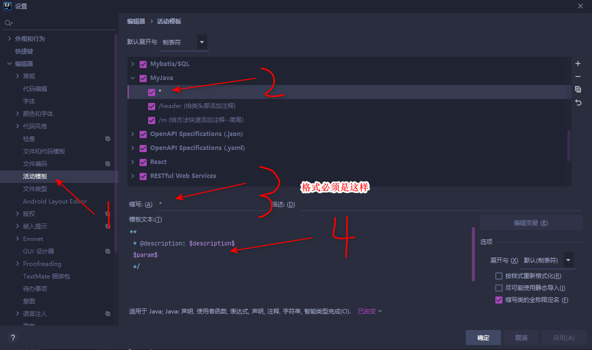

```
*
 * Description: $desc$
 *
 $param$
 * @return $return$
 * @author 黄天亮
 * @since  $date$
 */
```

 设置参数

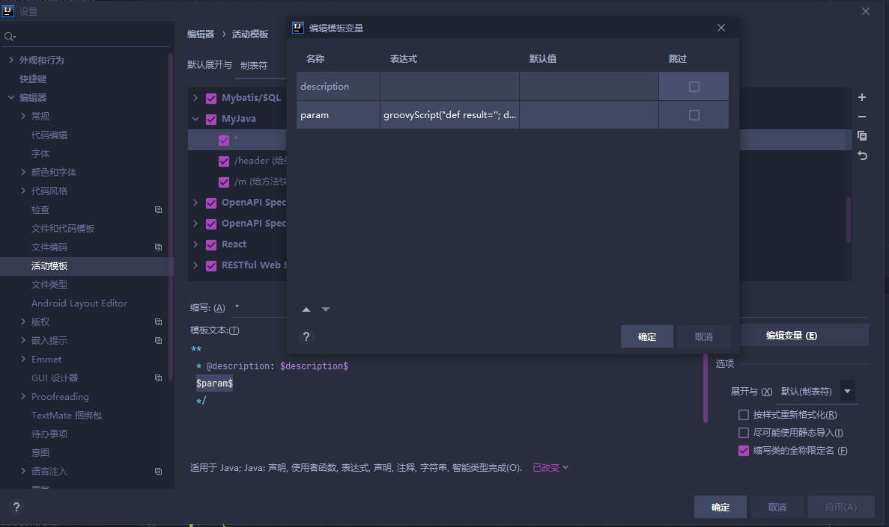

```java
 $param$ 参数
 groovyScript("def result=''; def params=\"${_1}\".replaceAll('[\\\\[|\\\\]|\\\\s]', '').split(',').toList(); for(i = 0; i < params.size(); i++) {result+='* @param ' + params[i] + ((i < params.size() - 1) ? '\\n\\t ' : '')}; return result", methodParameters())
```

**快捷键为  <kbd>/</kbd> +<kbd>*</kbd> + <kbd>tab</kbd>**

**效果**

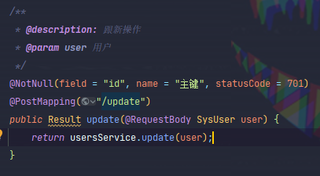

## 自定义类注释

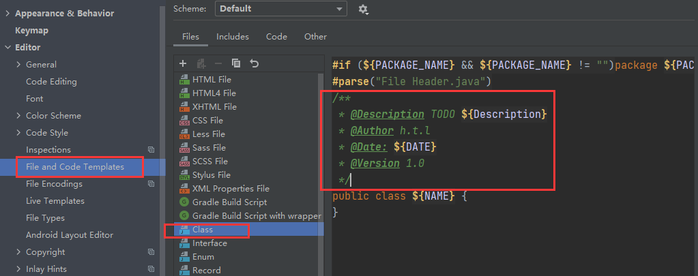

```
/**
 * $Description$
 *
 * @author 黄天亮
 * @since $date$ $time$
 */
```


## 自定Log注释

```
loge
log.error($content$,$params$);
content 参数：
groovyScript("def params = _2.collect {'【'+it+' = {}】'}.join(', '); return '\"' + _1 + '() called with exception => ' + (params.empty  ? '' : params) + '\"'", methodName(), methodParameters())
params参数：
groovyScript("def params = _1.collect {it}.join(', '); return   (params.empty  ? '' : params) + ',e' ",  methodParameters())

logm
log.info($content$,$params$);
content参数：
groovyScript("def params = _2.collect {'【'+it+' = {}】'}.join(', '); return '\"' + _1 + '() called with parameters => ' + (params.empty  ? '' : params) + '\"'", methodName(), methodParameters())
params参数：
groovyScript("def params = _1.collect {it}.join(', '); return   (params.empty  ? '' : params) ",  methodParameters())

```

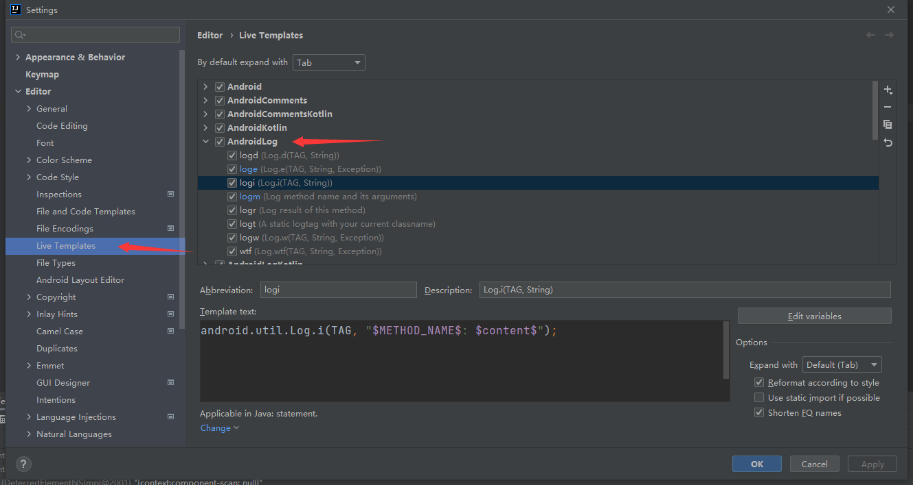


## 自定义mapper文件


​	代码：

```xml-dtd
<?xml version="1.0" encoding="UTF-8"?>
<!DOCTYPE mapper PUBLIC "-//mybatis.org//DTD Mapper 3.0//EN" "http://mybatis.org/dtd/mybatis-3-mapper.dtd">
<mapper namespace="">

</mapper>
```

## 自定义Spring XML 文件


```xml-dtd
<?xml version="1.0" encoding="UTF-8"?>
<beans xmlns="http://www.springframework.org/schema/beans"
       xmlns:xsi="http://www.w3.org/2001/XMLSchema-instance"
       xmlns:context="http://www.springframework.org/schema/context"
       xsi:schemaLocation="http://www.springframework.org/schema/beans
    http://www.springframework.org/schema/beans/spring-beans.xsd http://www.springframework.org/schema/context https://www.springframework.org/schema/context/spring-context.xsd">


</beans>

```


## 插件

**.ignore**

**Atom Material Icons**

**CodeGlance**

**JRebel for IntelliJ**  一款热部署插件，只要不是修改了项目的配置文件，用它都可以实现热部署。

**CamelCase** 将不是驼峰格式的名称，快速转成驼峰格式，安装好后，选中要修改的名称，按快捷键shift+alt+u。

**`jclasslib`**  查看字节码文件


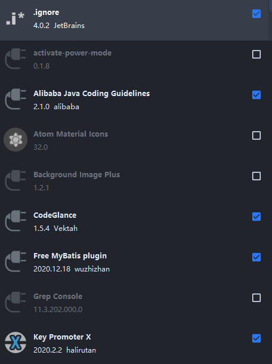

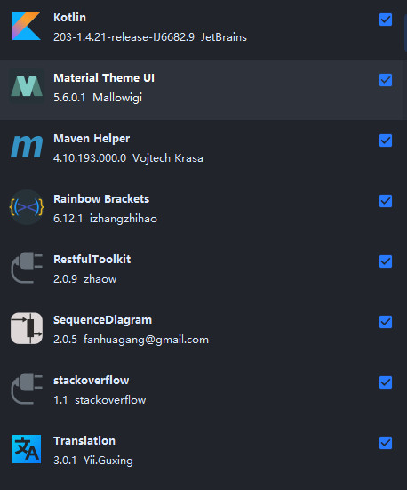

## 忽略文件设置


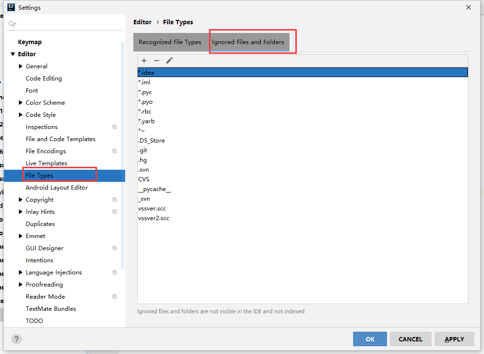

## 打开内存监测

内存监控的开启。不同版本开启方式不一样。

- IDEA2020版本开启方法：

双击shift，调出【Search Everywhere】窗口，输入

show memory indicator

- 2020之前版本查看方法：

  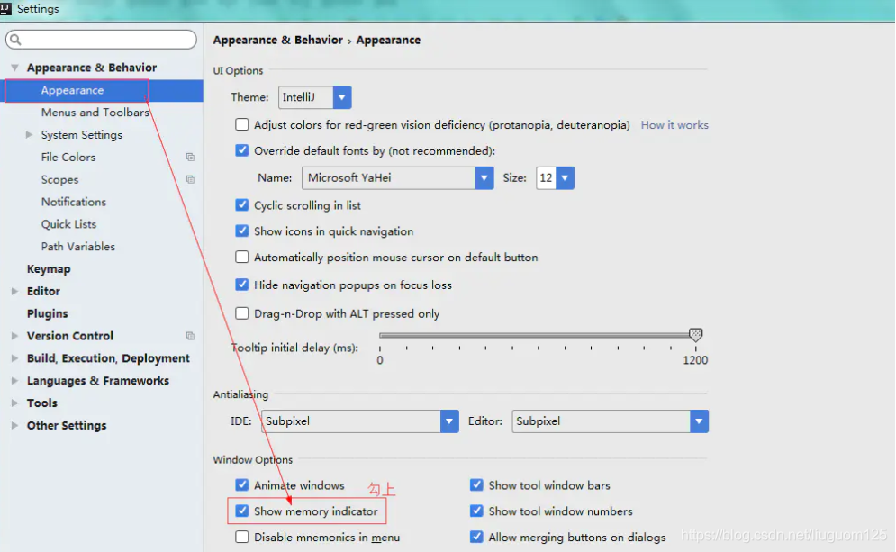

## JVM参数

| 参数                                         | 说明                                                         |
| -------------------------------------------- | ------------------------------------------------------------ |
| -Xms128m                                     | Java Heap初始值，Server端JVM最好将-Xms和-Xmx设为相同值，开发测试机JVM可以保留默认值 |
| -Xmx750m                                     | Java Heap最大值，默认值为物理内存的1/4，最佳设值应该视物理内存大小及计算机内其他内存开销而定 |
| -XX:ReservedCodeCacheSize=240m               | 预留保存代码的内存空间大小                                   |
| -XX:+UseConcMarkSweepGC                      | 老年代使用 CMS 垃圾回收策略（并发标记清除）                  |
| -XX:SoftRefLRUPolicyMSPerMB=50               | 每兆堆空闲空间中SoftReference的存活时间<br>LRU（Least Recently Used）最近最少使用。<br/>意思是最近最少被引用的软引用 将在50秒后被JVM清除。<br/>单位为秒。 |
| -ea                                          | ea 开启断言 -da 禁止断言                                     |
| -Dsun.io.useCanonCaches=false                | 使用佳能内存？？？                                           |
| -Djava.net.preferIPv4Stack=true              | 如果在使用ipv4的机器上运行启用了ipv6的系统，那么此参数设为true才能获取机器的完整机器名 |
| -Djdk.http.auth.tunneling.disabledSchemes="" | 根据域名自动下载https服务端发送过来的证书并保存成文件        |
| -XX:+HeapDumpOnOutOfMemoryError              | 当堆内存空间溢出时输出堆的内存快照                           |

```
-Xms1024m
-Xmx1024m
-XX:ReservedCodeCacheSize=1024m
-XX:+UseConcMarkSweepGC
```

博客：

https://blog.csdn.net/youanyyou/article/details/106490119?ops_request_misc=%257B%2522request%255Fid%2522%253A%2522161844934316780265444905%2522%252C%2522scm%2522%253A%252220140713.130102334.pc%255Fall.%2522%257D&request_id=161844934316780265444905&biz_id=0&utm_medium=distribute.pc_search_result.none-task-blog-2~all~first_rank_v2~rank_v29-1-106490119.first_rank_v2_pc_rank_v29&utm_term=IntelliJ+IDEA+%E5%86%85%E5%AD%98%E6%9C%80%E4%BD%B3%E9%85%8D%E7%BD%AE


## springboot 镜像

http://start.springboot.io

http://start.spring.io

http://start.aliyun.com

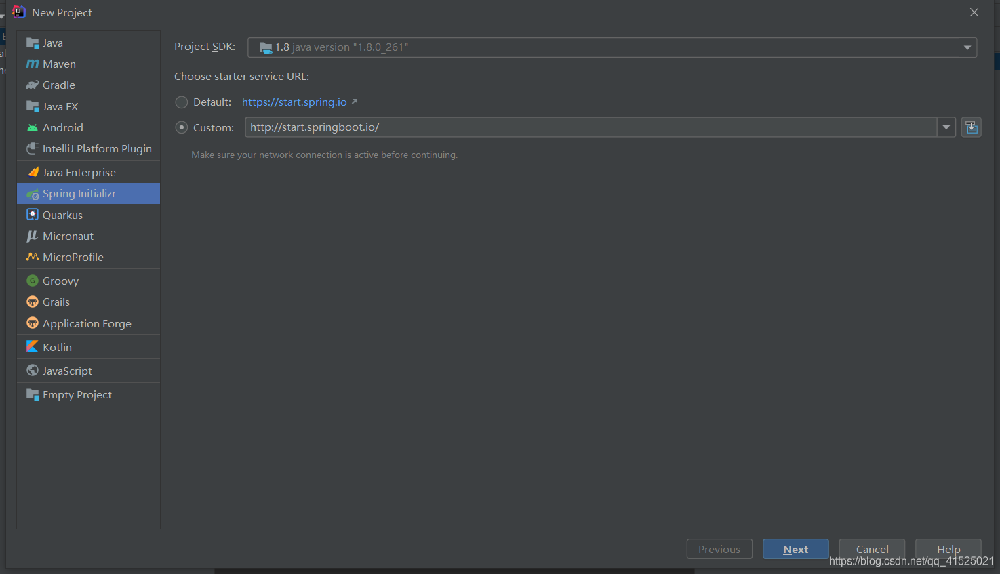

## idea tomcat console乱码

idea和tomcat在window默认为gbk编码，如果要修改编码请修改以下几个地方

1.idea安装目录/bin/ idea64.exe.vmoptions，idea.exe.vmoptions 添加-Dfile.encoding=UTF-8

2.idea菜单栏Help->Edit custom VM Options 添加-Dfile.encoding=UTF-8

3.tomcat启动项配置添加-Dfile.encoding=UTF-8

参考：[https://blog.csdn.net/u012611878/article/details/80723491](https://links.jianshu.com/go?to=https%3A%2F%2Fblog.csdn.net%2Fu012611878%2Farticle%2Fdetails%2F80723491)


## 配置文件路径

C:\Users\Administrator\AppData\Roaming\JetBrains

## 配置v2ray 代理

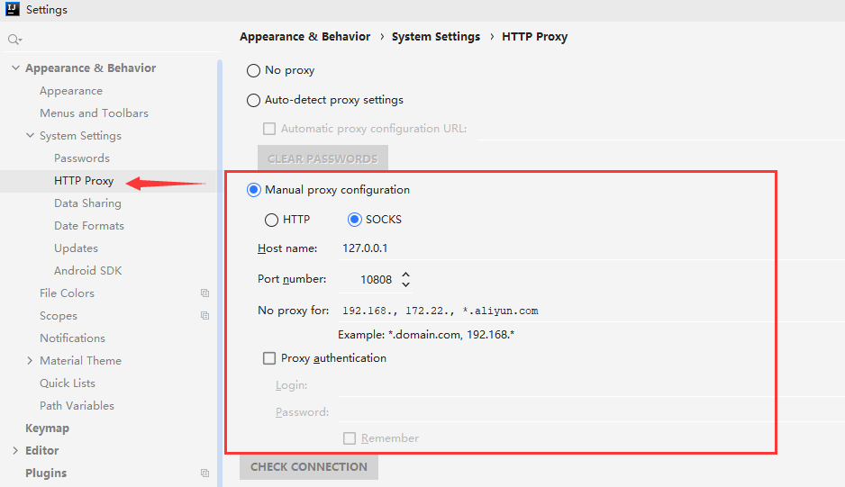


## 设置代码提示忽略大小写

最新操作：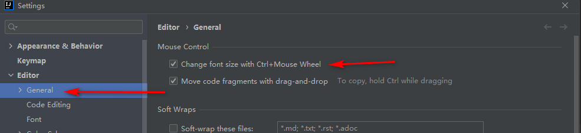

旧版操作：


## 设置代码提示快捷键

https://www.cnblogs.com/kkxwze/p/13446972.html

File–》Settings–》KeyMap(快捷键ctrl+alt+s)进入快捷键设置界面。
idea中默认的代码自动提示快捷键是Basic Ctrl+空格（可以再搜索框中输入basic快速查找），这个和安装的中文输入法切换快捷键冲突，所以需要修改。

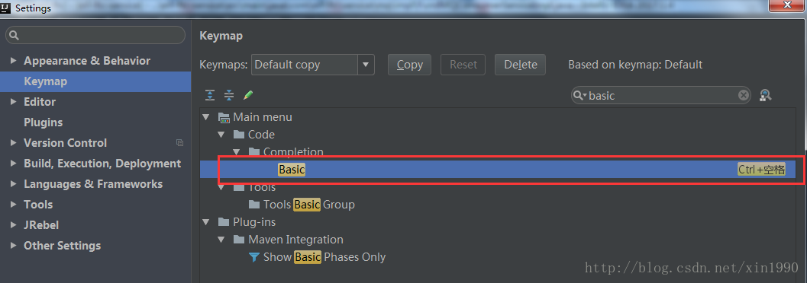


## 设置注释不顶行

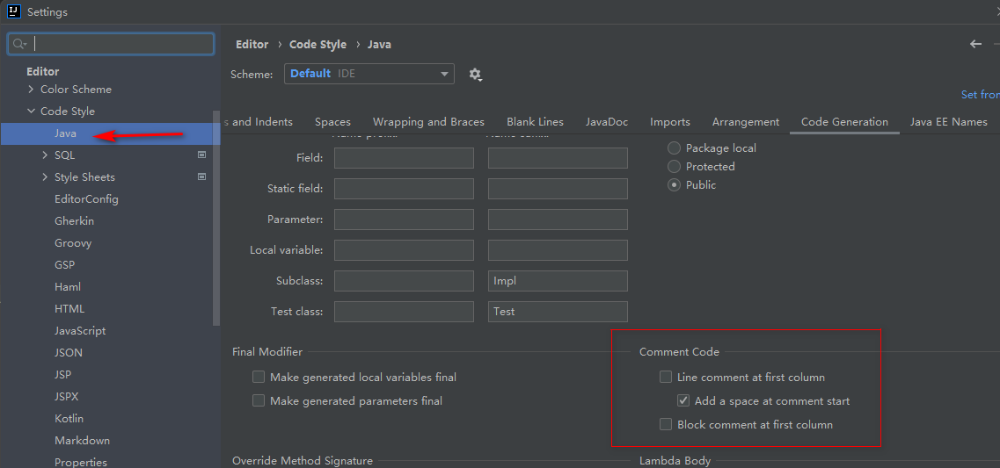


## 生成 Serializable 序列化 UID 的快捷键

**Settings --》 Editor --》 Inspections**

Serializable class without 'serialVersionUID'

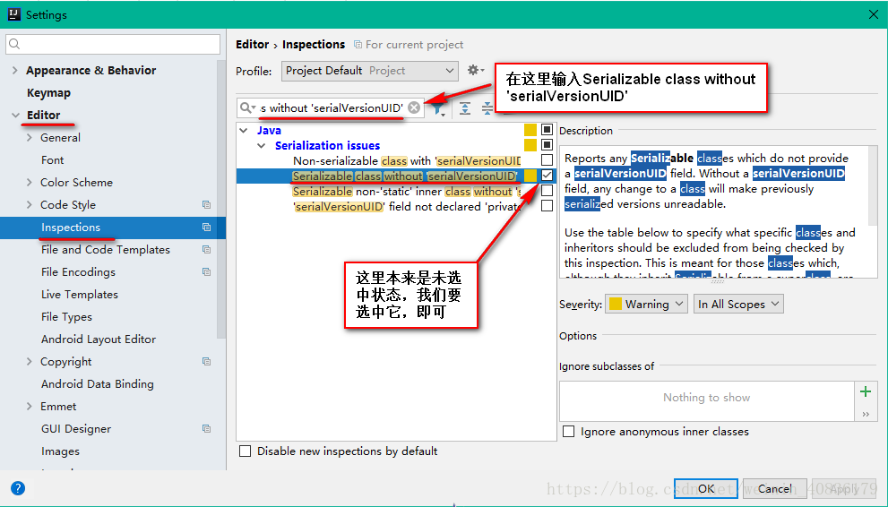

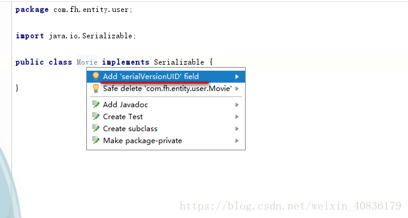


## 设置方法入参颜色不同

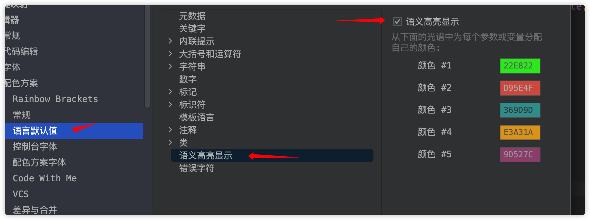

## 设置Git提示信息显示


