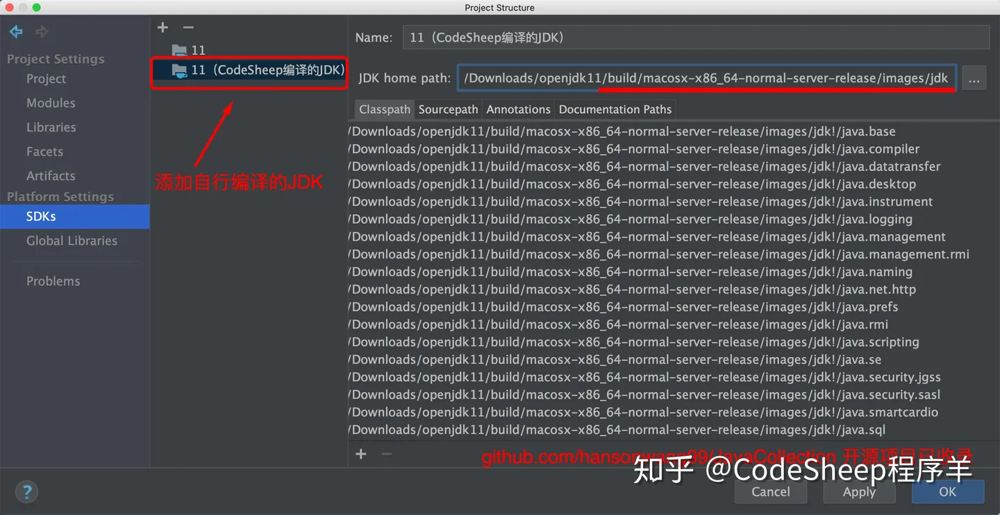
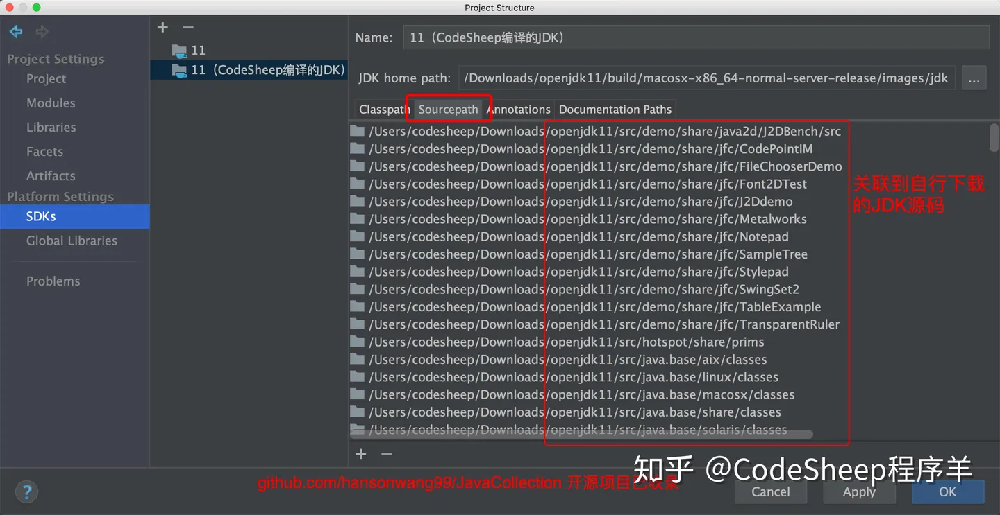
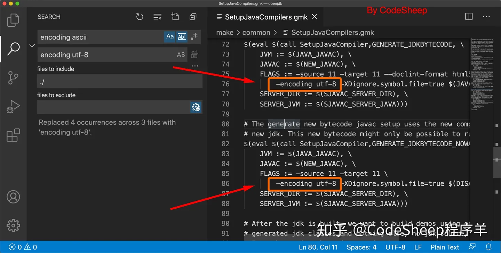

# 编译jdk11 源码

资源：

[B站CodeSheep](https://www.bilibili.com/video/BV1zT4y177Zf/?spm_id_from=333.337.search-card.all.click&vd_source=b228bd46ba1fa2f17fbfc85871bb7759)

[CodeSheep博客](https://zhuanlan.zhihu.com/p/160776269)


##### 第一步

**下载源码**

方式一

```bash
# OpenJDK是用mercurial管理的
sudo yum install mercurial

# 下载
hg clone http://hg.openjdk.java.net/aarch64-port/jdk8u
hg clone https://hg.openjdk.org/jdk/jdk11/
```

方式二

```bash
# 下载压缩包
# github
https://github.com/openjdk/jdk
```

##### 第二步

```bash
// 源码根目录 ， 要在控制台执行， idea 的控制台有bug
cd /Users/aurora/JDK/jdk11u-jdk  

sh ./get_source.sh

sh configure \
  --with-target-bits=32 \
  --enable-debug \
  --enable-dtrace \
  --disable-ccache \
  --disable-warnings-as-errors \
 
  --with-jvm-variants=server \
  --with-boot-jdk=/Library/Java/JavaVirtualMachines/zulu-11.jdk/Contents/Home \
  --with-toolchain-path=/Applications/Xcode.app/Contents/Developer/usr/bin
  
  
  sh configure \
    --with-boot-jdk=/usr/lib/jvm/java-8-openjdk-arm64
  --enable-debug \
  --with-freetype-include=/usr/include/freetype2 \
  --with-freetype-lib=/usr/lib/aarch64-linux-gnu
```

##### 第三步

```bash
make all
make clean

# item2终端运行
make images

# 指定版本编译 mac / ubuntu
make images CONF=macosx-aarch64-normal-server-release
 make images CONF=linux-aarch64-normal-server-release
 
 #指定make 目录运行
 make -C USpace/jdk/jdk11u/ images CONF=macosx-aarch64-normal-server-release
```

##### 第四步：关联JDK源码并修改

```bash
# JDK home path: /Users/aurora/CodeSpace/jdk/jdk11u/build/macosx-aarch64-normal-server-release/images/jdk
```





### 问题解决


##### The tested number of bits in the target (64) differs from the number of bits expected to be found in the target (32)

```bash
解决：

/Users/aurora/JDK/jdk-jdk-11-28/make/autoconf/platform.m4
找到 The tested number of bits in the target 所在位置
修改这两个参数值为64
    TESTED_TARGET_CPU_BITS=64
    OPENJDK_TARGET_CPU_BITS=64
```


##### JDK源码添加中文注释后编译乱码

```
// 进入以下目录
cd jdk/make/common

//编辑文件
vi SetupJavaCompilers.gmk 

// 找到“-encoding ascii“，替换成 ”-encoding utf-8“
```



##### configure: error: Could not find freetype! 

```bash
  sh configure \
  --enable-debug \
  --with-freetype-include=/usr/include/freetype2 \
  --with-freetype-lib=/usr/lib/aarch64-linux-gnu
```


