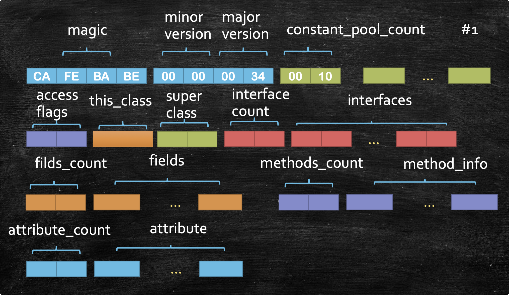
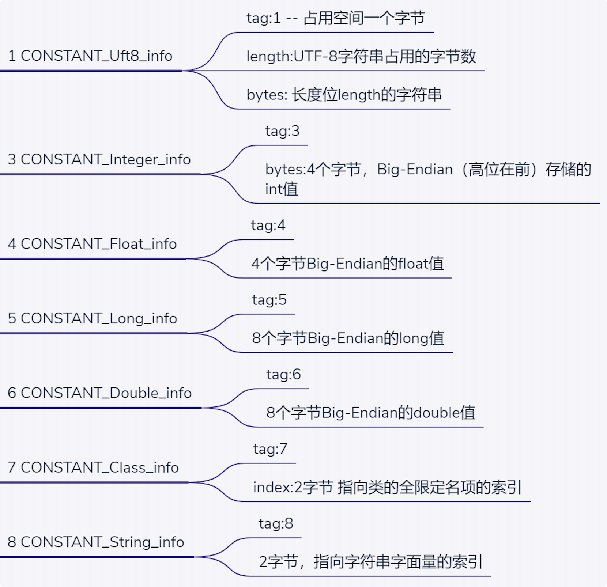
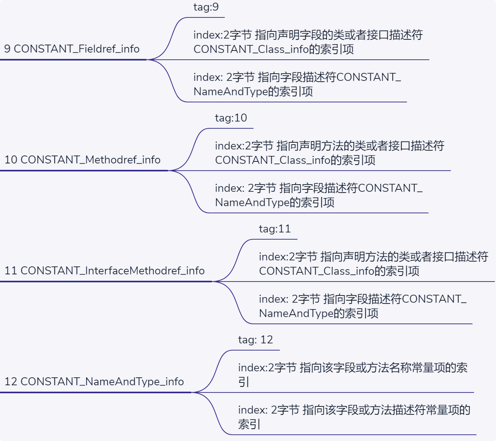
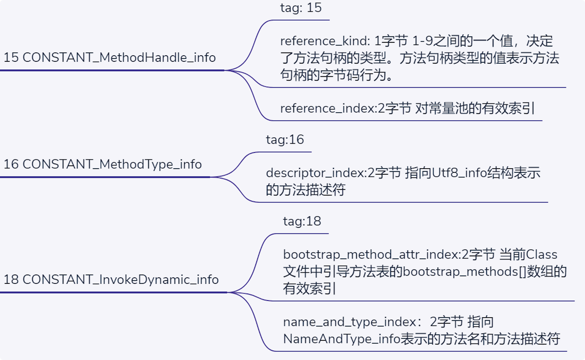
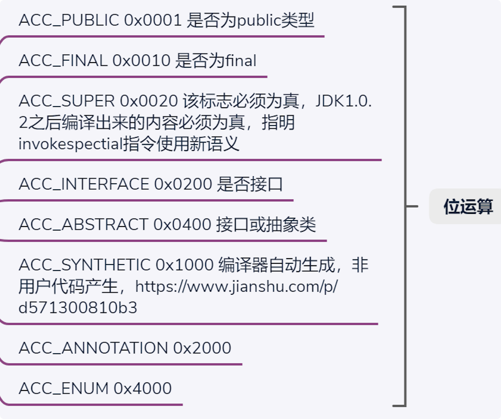
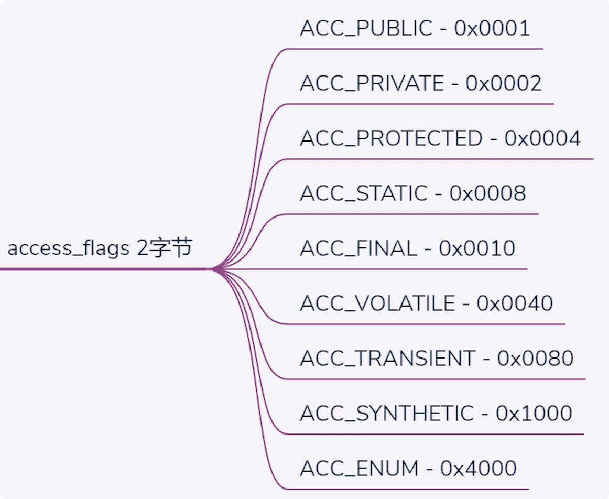
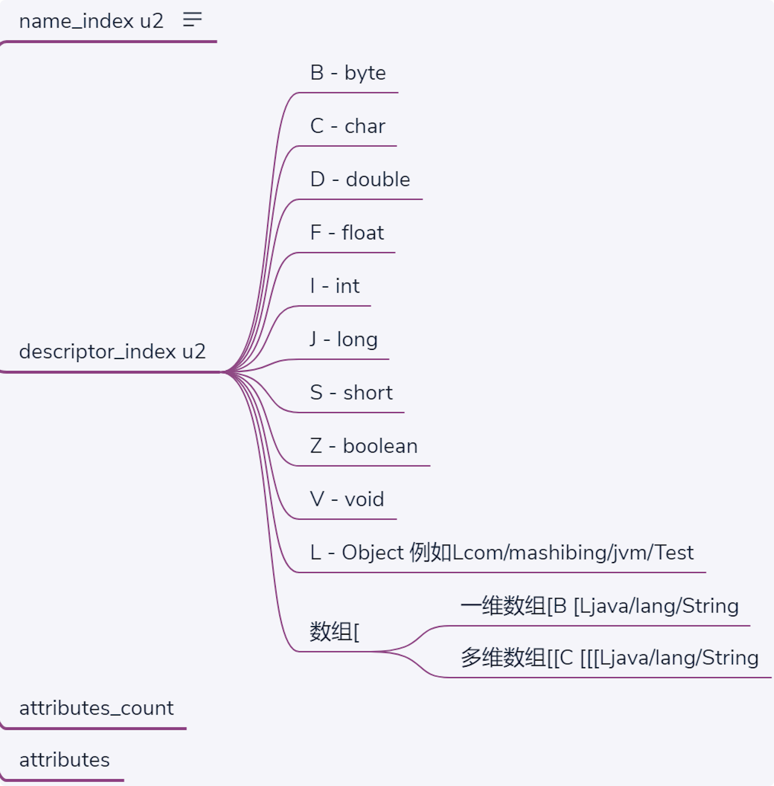
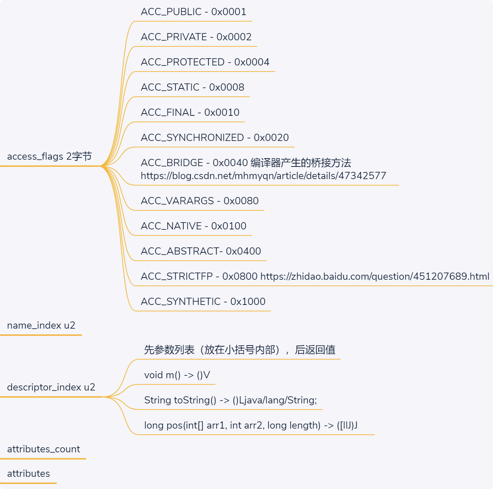
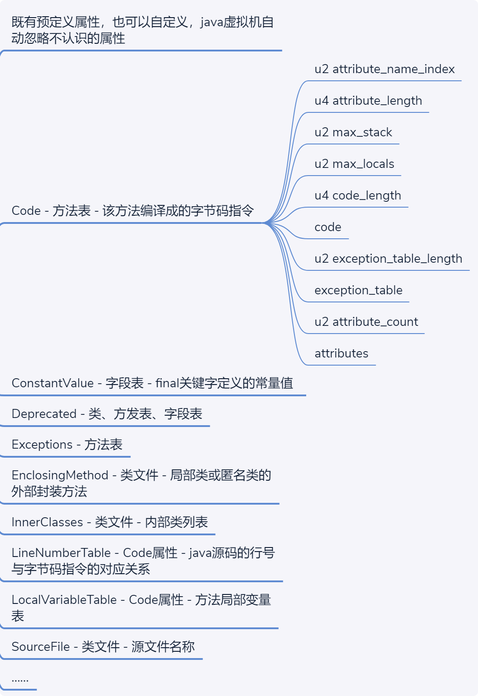

# Class File  Format

```js
ClassFile {
  u4 				     magic; 
  u2 				     minor_version; 
  u2 				     major_version; 
  u2 				     constant_pool_count; 
  cp_info        constant_pool[constant_pool_count-1]; 
  u2 				     access_flags; 
  u2 				     this_class; 
  u2 				     super_class; 
  u2 				     interfaces_count; 
  u2 				     interfaces[interfaces_count]; 
  u2 				     fields_count; 
  field_info     fields[fields_count]; 
  u2 				     methods_count; 
  method_info    methods[methods_count]; 
  u2 				     attributes_count; 
  attribute_info attributes[attributes_count];

}

// u2表示2字节 u4表示4字节
```




## 组成部分

#### magic

Java 固定为：**CA FE  BA BE**

#### minor_version & major_version 

 class文件的版本号（JDK1.7=51 JDK1.8=52）

一共4字节

#### constant_pool_count

常量池数量

2字节

#### constant_pool

长度 = constant_pool_count -1



#### access_flag




#### this_class

2字节

#### super_class

2字节

#### interfaces_count

2字节

#### interfaces

**interfaces[interfaces_count]**

2字节

#### fields_count

2字节

#### field_info

 **fields[fields_count];** 



#### methods_count


####   method_info    

**methods[methods_count];** 



#### attributes_count


####   attribute_info 

attributes[attributes_count];




