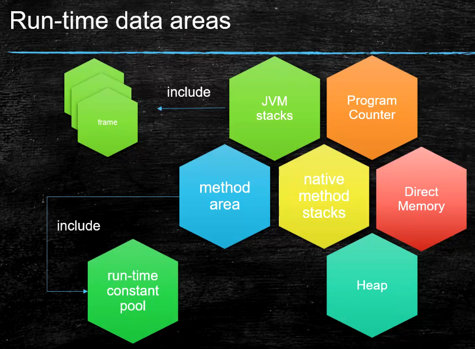

## Runtime Data Area and Instruction Set

jvms13   jls12

### 指令集分类

1. 基于寄存器的指令集
2. 基于栈的指令集
   Hotspot中的Local Variable Table = JVM中的寄存器

### Runtime Data Area

PC  程序计数器

> 存放指令位置
>
> 虚拟机的运行，类似于这样的循环：
>
> while( not end ) {
>
> ​	取PC中的位置，找到对应位置的指令；
>
> ​	执行该指令；
>
> ​	PC ++;
>
> }

JVM Stack

1. Frame - **每个方法对应一个栈帧**
   1. Local Variable Table  局部变量表
   2. Operand Stack  操作数堆栈
      对于long的处理（store and load），多数虚拟机的实现都是原子的
      jls 17.7，没必要加volatile
   3. Dynamic Linking
      https://blog.csdn.net/qq_41813060/article/details/88379473 
      jvms 2.6.3
   4. return address
      a() -> b()，方法a调用了方法b, b方法的返回值放在什么地方
   5. 

Heap

Method Area

下面两种是Method Area 的具体实现

1. Perm Space (<1.8)
   字符串常量位于PermSpace
   FGC不会清理
   大小启动的时候指定，不能变
2. Meta Space (>=1.8)
   字符串常量位于堆
   会触发FGC清理
   不设定的话，最大就是物理内存

Runtime Constant Pool

Native Method Stack

Direct Memory

> JVM可以直接访问的内核空间的内存 (OS 管理的内存)
>
> NIO ， 提高效率，实现zero copy

思考：

> 如何证明1.7字符串常量位于Perm，而1.8位于Heap？
>
> 提示：结合GC， 一直创建字符串常量，观察堆，和Metaspace

### 结构总结

## 常用指令

store

load

pop

mul

sub

invoke

1. InvokeStatic

2. InvokeVirtual

   自带多态

3. InvokeInterface

4. InovkeSpecial
   可以直接定位，不需要多态的方法
   private 方法 ， 构造方法

5. InvokeDynamic
   JVM最难的指令
   lambda表达式或者反射或者其他动态语言scala kotlin，或者CGLib ASM，动态产生的class，会用到的指令

