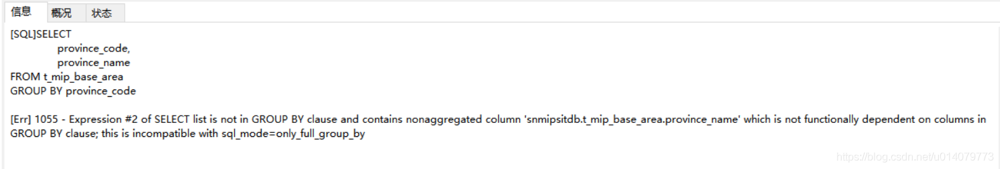

## 1.  ONLY_FULL_GROUP_BY 问题

使用一下写法：

```sql
SELECT 
    province_code,
    province_name
FROM t_mip_base_area
GROUP BY province_code
```

出现错误：



解决方式：

```sql
1、使用any_value（）函数
SELECT 
	province_code,
	any_value(province_name)
FROM t_mip_base_area
GROUP BY province_code
2、
SELECT 
    province_code,
    province_name
FROM t_mip_base_area
GROUP BY province_code,province_name
3、
SELECT
	DISTINCT(province_code),
	province_name
FROM
	t_mip_base_area
```

总结：

1.MySQL5.7之后，sql_mode中ONLY_FULL_GROUP_BY模式默认设置为打开状态。

2.ONLY_FULL_GROUP_BY的语义就是确定select target list中的所有列的值都是明确语义，简单的说来，在此模式下，target list中的值要么是来自于聚合函数（sum、avg、max等）的结果，要么是来自于group by list中的表达式的值

3.MySQL提供了any_value()函数来抑制ONLY_FULL_GROUP_BY值被拒绝

4.==any_value()会选择被分到同一组的数据里第一条数据的指定列值作为返回数据==


## 2.设置时区

1.1 查看mysql当前时间，当前时区

```bash
> select curtime();   #或select now()也可以
+-----------+
| curtime() |
+-----------+
| 15:18:10  |
+-----------+

> show variables like "%time_zone%";
+------------------+--------+
| Variable_name    | Value  |
+------------------+--------+
| system_time_zone | CST    |
| time_zone        | SYSTEM |
+------------------+--------+
2 rows in set (0.00 sec)
#time_zone说明mysql使用system的时区，system_time_zone说明system使用CST时区
```


1.2 修改时区

```cmd
> set global time_zone = '+8:00';  ##修改mysql全局时区为北京时间，即我们所在的东8区
> set time_zone = '+8:00';  ##修改当前会话时区
> flush privileges;  #立即生效
```


方法二：通过修改my.cnf配置文件来修改时区

```cmd
# vim /etc/my.cnf  ##在[mysqld]区域中加上
default-time_zone = '+8:00'

# /etc/init.d/mysqld restart  ##重启mysql使新时区生效
```

## 3.mysql锁表查询和解锁操作

**1、在做数据库操作时，有时会因为自己的粗心或者程序设计上的缺陷导致锁表，在mysql中查看锁表和解锁的步骤如下：**

```mysql
//1.查看当前数据库锁表的情况
SELECT * FROM information_schema.INNODB_TRX;

//2.杀掉查询结果中锁表的trx_mysql_thread_id
kill trx_mysql_thread_id
```

**2、另外一种查询锁方法**

```mysql
    1、查询是否锁表
    show OPEN TABLES where In_use > 0; 
    2、查询进程
    show processlist
    查询到相对应的进程===然后 kill    id
    补充：
    查看正在锁的事务
    SELECT * FROM INFORMATION_SCHEMA.INNODB_LOCKS; 
    查看等待锁的事务
    SELECT * FROM INFORMATION_SCHEMA.INNODB_LOCK_WAITS;
```

## 4..打印表结构信息

```sql
SELECT
  COLUMN_NAME 列名,
  COLUMN_TYPE 数据类型,
    DATA_TYPE 字段类型,
  CHARACTER_MAXIMUM_LENGTH 长度,
  IS_NULLABLE 是否为空,
  COLUMN_DEFAULT 默认值,
  COLUMN_COMMENT 备注 
FROM
 INFORMATION_SCHEMA.COLUMNS
where
-- developerclub为数据库名称，到时候只需要修改成你要导出表结构的数据库即可
table_schema ='ktna-healthbank'
AND
-- article为表名，到时候换成你要导出的表的名称
-- 如果不写的话，默认会查询出所有表中的数据，这样可能就分不清到底哪些字段是哪张表中的了，所以还是建议写上要导出的名名称
table_name  = 'sys_parameter'
```