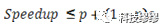

## 常见名词解释
### 吞吐量

从业务角度看，吞吐量可以用：请求数/秒、页面数/秒、人数/天或处理业务数/小时等单位来衡量

从网络角度看，吞吐量可以用：字节/秒来衡量

对于交互式应用来说，吞吐量指标反映的是服务器承受的压力，他能够说明系统的负载能力

以不同方式表达的吞吐量可以说明不同层次的问题，例如，以字节数/秒方式可以表示数要受网络基础设施、服务器架构、应用服务器制约等方面的瓶颈；已请求数/秒的方式表示主要是受应用服务器和应用代码的制约体现出的瓶颈。

当没有遇到性能瓶颈的时候，吞吐量与虚拟用户数之间存在一定的联系，可以采用以下公式计算：F=VU * R /

其中F为吞吐量，VU表示虚拟用户个数，R表示每个虚拟用户发出的请求数，T表示性能测试所用的时间

### QPS/TPS

**QPS：**Queries Per Second意思是“每秒查询率”，是一台[服务器](https://cloud.tencent.com/product/cvm?from=10680)每秒能够相应的查询次数，是对一个特定的查询服务器在规定时间内所处理流量多少的衡量标准。

**TPS：**是Transactions Per Second的缩写，也就是事务数/秒。它是软件测试结果的测量单位。一个事务是指一个客户机向服务器发送请求然后服务器做出反应的过程。客户机在发送请求时开始计时，收到服务器响应后结束计时，以此来计算使用的时间和完成的事务个数。

Tps即每秒处理事务数，包括了

1）用户请求服务器

2）服务器自己的内部处理

3）服务器返回给用户

这三个过程，每秒能够完成N个这三个过程，Tps也就是3；

Qps基本类似于Tps，但是不同的是，对于一个页面的一次访问，形成一个Tps；但一次页面请求，可能产生多次对服务器的请求，服务器对这些请求，就可计入“Qps”之中。

例如：访问一个页面会请求服务器3次，一次放，产生一个“T”，产生3个“Q” 

### 并发数

简而言之，系统能同时处理的请求/事务数量。

### RT

响应时间（RT）：响应时间是指系统对请求作出响应的时间，一般取平均响应时间。可以通过Nginx、Apache之类的Web Server得到。

Response Time缩写，简单理解为系统从输入到输出的时间间隔，宽泛的来说，他代表从客户端发起请求到服务端接受到请求并响应所有数据的时间差。一般取平均响应时间。

### PV

**PV**（Page View）：页面访问量，即页面浏览量或点击量，用户每次刷新即被计算一次。可以统计服务一天的访问日志得到。

### UV

**UV**（Unique Visitor）：独立访客，统计1天内访问某站点的用户数。可以统计服务一天的访问日志并根据用户的唯一标识去重得到。

### DAU

**DAU**(Daily Active User)，日活跃用户数量。常用于反映网站、互联网应用或网络游戏的运营情况。DAU通常统计一日（统计日）之内，登录或使用了某个产品的用户数（去除重复登录的用户），与UV概念相似！

### MAU

**MAU**(Month Active User)：月活跃用户数量，指网站、app等去重后的月活跃用户数量！

### 计算方式

**<u>QPS=并发数/RT</u>**   或者   **<u>并发数=QPS*RT</u>**

举个栗子：

假设公司每天早上9点到10点1个小时内都有员工要上厕所，公司有3600个员工，平均每个员工上厕所时间为10分钟，我们来计算一下。

QPS    = 3600/(60\*60)   1

RT      = 10\*60            600秒

并发数 = 1 * 600          600

这样就意味着如果想达到最好的蹲坑体验，公司需要600个坑位来满足员工需求，否则的话上厕所就要排队等待了。

### 性能思考

按照QPS=并发数/RT公式，假设我们现在是单线程的场景，那么QPS公式应该是这样：QPS=1/RT，实际上RT应该=CPU time + CPU wait time，如果将线程数提高到2，那么QPS=2/(CPU time + CPU wait time)，那么是否意味着我们只要单纯提高线程数就能提高QPS呢？

### 最佳线程数计算

假设CPU time是49ms，CPU wait time是200ms，那么QPS=1000ms/249ms=4.01，这里200ms的wait时间我们可以认为CPU一直处于等待状态啥也没干，理论上来说200ms还可以接受200/49≈4个请求，不考虑上下文切换和其他开销的话，可以认为总线程数=(200+49)/49=5，如果再考虑上CPU多核和利用率的问题，我们大致可以认为：**最佳线程数=RT/CPU Time \* CPU核心数 \* CPU利用率**

那么最大QPS公式推导为：

最大QPS=最佳线程数\*单线程QPS=（**RT/CPU Time \* CPU核心数 \* CPU利用率）\*（1/RT) = CPU核心数\*CPU利用率/CPU time**

### 古斯塔夫森定律Gustafson

斯塔夫森定律又被称为扩展的加速比(scaled speedup)，他说明处理器个数、串行比例和加速比之间的关系，只是和阿姆达尔定律侧重角度有所不同。

按照阿姆达尔定律和QPS计算公式，在CPUtime 和 CPU利用率不变的情况下，增加CPU核心数就能增加最大QPS，在par不为0即并行的时候，增加并行数量p就能提升效率，但是实际上随着请求数量的增加，带来大量的上下文的切换、gc和锁变化。qps更高，产生对象越多，gc越频繁，cpu time和利用率都受到影响，尤其在串行的时候，锁自旋、自适应、偏向等等也成为影响par的因素。

总结，为了提升达到最好的性能，我们需要不断的进行性能测试，调整小城池大小，找到最合适的参数来达到提高性能的目的。

## 常见QPS监控方法

## 资源

https://cloud.tencent.com/developer/article/1688947

https://www.cnblogs.com/lvzhenjiang/articles/16398609.html