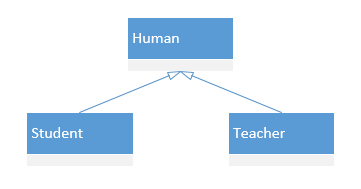

# 七大设计原则

`开闭原则 `（Open Close Principle）：用抽象构建架构，用实现扩展细节，对扩展开放，对修改关闭。

`依赖倒置原则`（Dependence Inversion Principle） ：高层模块不应该依赖于底层模块，二者都应该依赖其抽象

`单一职责原则`：单个接口或类不应该有多个职责，应该尽可能的划分职责，通过组合的方式，完成更为复杂的业务

`接口隔离原则`（Interface Segregation Principle）：一个接口不要包含过多的职责，应合理划分，跟单一职责原则相辅相成

>典型场景：动物、人、鸟，人和鸟都会吃，人会走路，鸟会飞，应该把走路和飞这两个行为抽象成接口，通过组合的方式让人拥有走路的行为，让鸟拥有飞的行为。再细划分，人有多个走路姿势，鸟有多个飞行方式，可以分别继承走路和飞的抽象行为扩展其具体的行为

- 客户端不应依赖它不需要的接口
- 类间的依赖关系应该建立在最小的接口上

`迪米特法则`（LKP）（Demeter Principle）：也就最少知道原则，一个对象尽量让其它对象保持最少的了解

> 典型场景：我点外卖，我只关心外卖员，不关系具体的店。我的类中只依赖外卖员，不会依赖具体的店。是不是静态代理。

`里氏替换原则`（Liskov Substitution Principle）：在引用父类的地方，都可以替换为其子类。从而可以实现子类间的动态切换。换句话说就是要有面向接口的编程思维。结合“开闭原则”，完美

- 里氏替换原则是针对继承而言的，如果继承是为了实现代码重用，也就是为了共享方法，那么共享的父类方法就应该保持不变，不能被子类重新定义。子类只能通过新添加方法来扩展功能，父类和子类都可以实例化，而子类继承的方法和父类是一样的，父类调用方法的地方，子类也可以调用同一个继承得来的，逻辑和父类一致的方法，这时用子类对象将父类对象替换掉时，当然逻辑一致，相安无事。
- 如果继承的目的是为了多态，而多态的前提就是子类覆盖并重新定义父类的方法，为了符合LSP，我们应该将父类定义为抽象类，并定义抽象方法，让子类重新定义这些方法，当父类是抽象类时，父类就是不能实例化，所以也不存在可实例化的父类对象在程序里。也就不存在子类替换父类实例（根本不存在父类实例了）时逻辑不一致的可能。

`合成复用原则`（Composite Reuse Principle）：多用组合，少用继承

# 类关系

`依赖` ： 类中用到了对方

`泛化` ： 相当于继承，依赖关系的特例

`实现` ：实现接口

`关联`：类于类之间的联系，他是依赖关系的特例。具有导航性（单向关系和双向关系），具有多重性（0… ; 0,1 ; n…m）

`聚合`：表示整体与部分的关系，整体与部分可以分开，聚合关系是关联关系的特例，所以具有导航性和多重性。符号是菱形箭头

`组合`：表示整体与部分的关系，*整体与部分不可以分开*，

