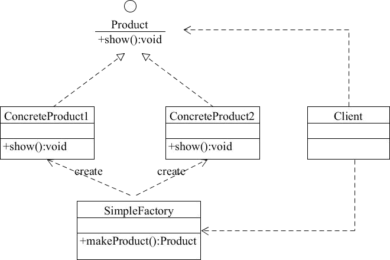
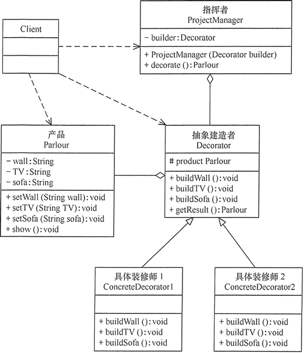

设计模式的分类
总体来说设计模式分为三大类：

==创建型模式==，共五种：工厂方法模式、抽象工厂模式、单例模式、建造者模式、原型模式。

==结构型模式==，共七种：适配器模式、装饰器模式、代理模式、外观模式、桥接模式、组合模式、享元模式。

==行为型模式==，共十一种：策略模式、模板方法模式、观察者模式、迭代子模式、责任链模式、命令模式、备忘录模式、状态模式、访问者模式、中介者模式、解释器模式。

### 单例模式

#### 懒汉式

#### 饿汉式

拓展：多例模式

### 原型模式

### 工厂方法模式

#### 简单工厂

#### 工厂模式

### 抽象工厂模式

### 建造者模式

### 代理模式

**拓展：**

