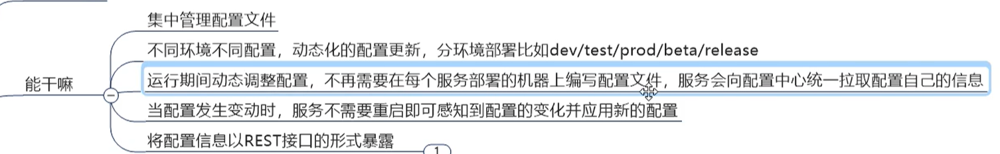

测试：http://config3344.com:3344/main/config-dev.yml

客户端配置中心

http://localhost:3355/configInfo

客户端动态刷新问题

中心配置仓库修改之后，需要重新发起下面的刷新请求，客户端才能动态的访问

curl -X POST "http://localhost:3355/actuator/refresh"

缺点是服务太多时，需要每个服务进行定点刷新

