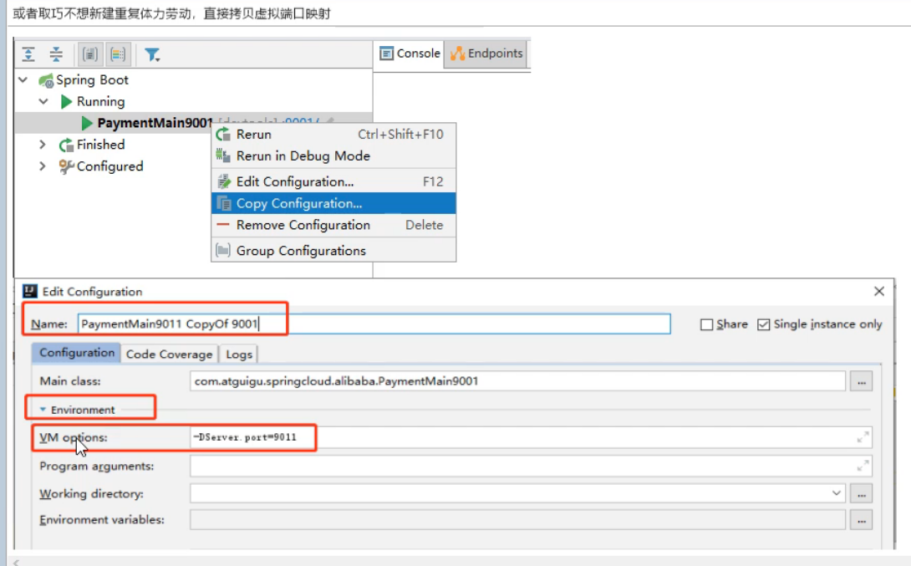
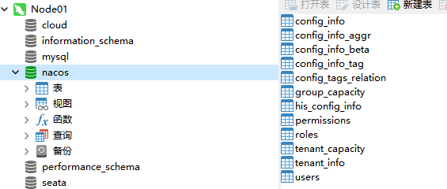

# Nacos

一个更易于构建云原生应用的动态服务发现、配置管理和服务管理平台。


Nacos = Eureka + Config + Bus

https://github.com/alibaba/nacos

https://nacos.io/zh-cn/


下载：https://github.com/alibaba/nacos/releases/tag/1.4.1




# Nacos

一个更易于构建云原生应用的动态服务发现、配置管理和服务管理平台。


Nacos = Eureka + Config + Bus

https://github.com/alibaba/nacos

https://nacos.io/zh-cn/


下载：https://github.com/alibaba/nacos/releases/tag/1.4.1


## nacos 服务启动

### Linux

1.配置application.properties文件

```properties
spring.datasource.platform=mysql

### Count of DB:
db.num=1

### Connect URL of DB:
db.url.0=jdbc:mysql://127.0.0.1:3306/nacos?characterEncoding=utf8&connectTimeout=1000&socketTimeout=3000&autoReconnect=true&useUnicode=true&useSSL=false&serverTimezone=UTC
db.user.0=root
db.password.0=123456
```

2.创建名字为 `nacos` 的数据库，运行`nacos-mysql.sql` 文件



2.进入bin目录，默认单机启动

sh startup.sh -m standalone

日志输出目录/usr/local/nacos/logs/start.out

网页访问：http://192.168.204.130:8848/nacos/index.html  nacos nacos
