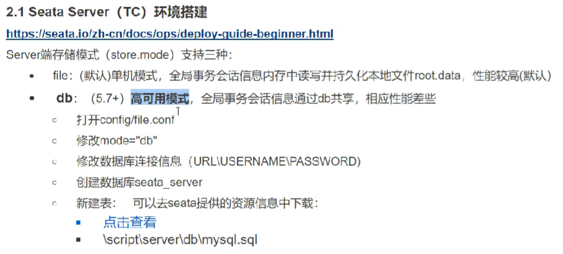
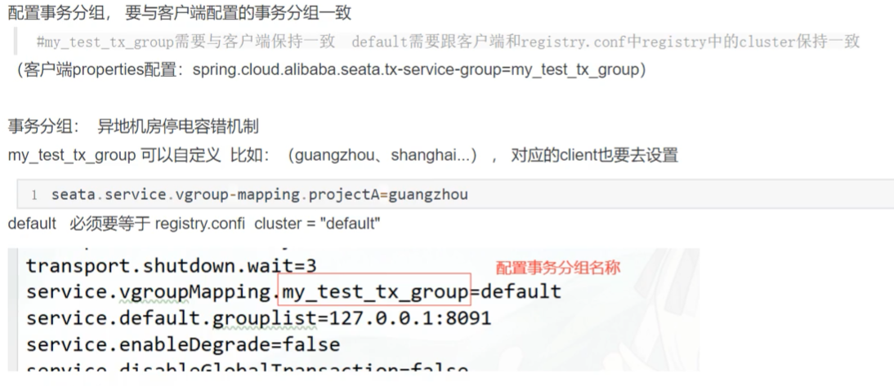
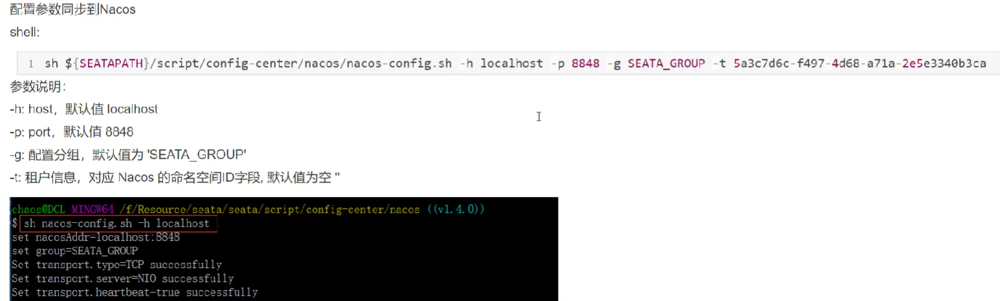
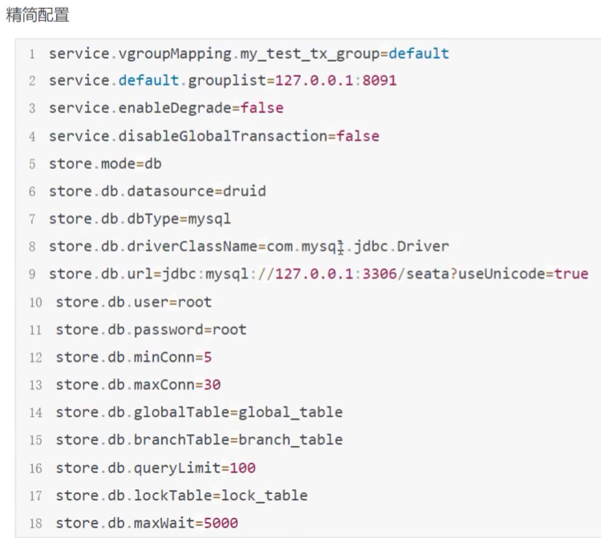
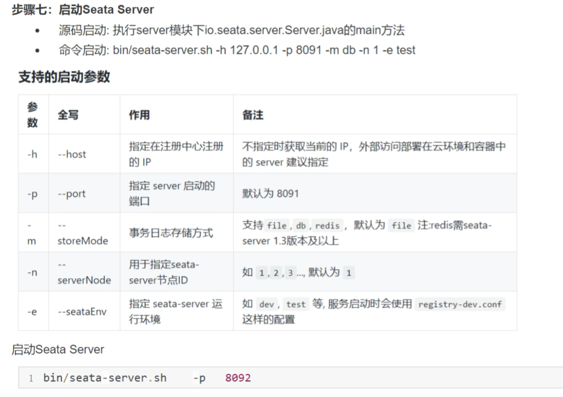
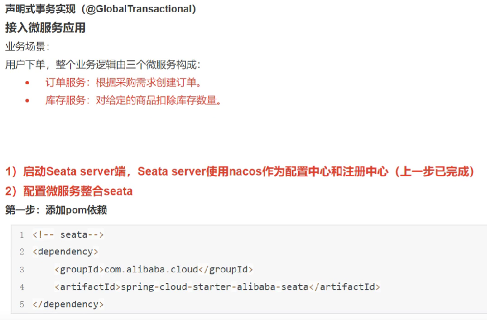
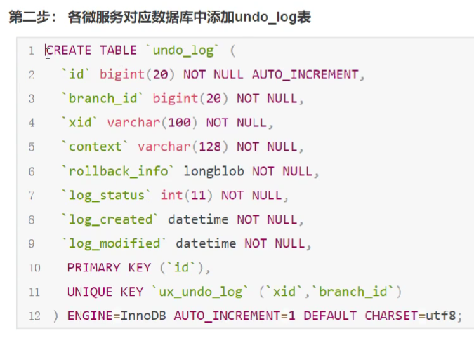

# Seata 配置使用

@GlobalTransacational

## Seata Server (TC) 环境搭建

https://seata.io/zh-cn/docs/ops/deploy-guide-beginner.html

资源目录

[点击查看](https://github.com/seata/seata/tree/1.4.0/script)

- client

> 存放client端sql脚本 (包含 undo_log表) ，参数配置

- config-center

> 各个配置中心参数导入脚本，config.txt(包含server和client，原名nacos-config.txt)为通用参数文件

- server

> server端数据库脚本 (包含 lock_table、branch_table 与 global_table) 及各个容器配置

## Seata Client 快速开始

对seata client进行配置，在springboot2.1之前需要在register.conf中进行配置，但是之后只需要在application.yum中配置即可

