# Seata 处理分布式事务

http://seata.io/zh-cn/


### Seata术语

##### TC (Transaction Coordinator) - 事务协调者

维护全局和分支事务的状态，驱动全局事务提交或回滚。

##### TM (Transaction Manager) - 事务管理器

定义全局事务的范围：开始全局事务、提交或回滚全局事务。

##### RM (Resource Manager) - 资源管理器

管理分支事务处理的资源，与TC交谈以注册分支事务和报告分支事务的状态，并驱动分支事务提交或回滚。


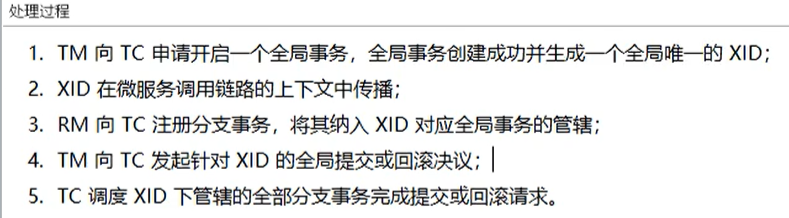

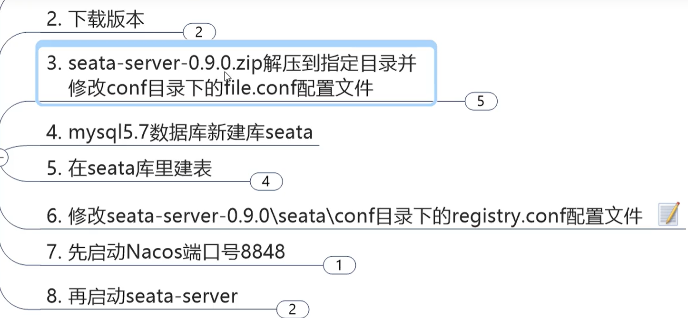

第一步修改file.conf

- service 模块

  ```xml-dtd
  service {
    vgroup_mapping.my_test_tx_group = "huang_tx_group"  # 这里自定义为自己的分组
  }
  ```

- store 模块

```xml-dtd
# 将store 设置为 db , 并配置数据库信息
store {
  mode = "db"
  db {
    datasource = "dbcp"
    db-type = "mysql"
    driver-class-name = "com.mysql.jdbc.Driver"
    url = "jdbc:mysql://8.131.59.205:3306/seata_account"
    user = "haung"
    password = "huang"
    ......
  }
}
```

修改registry.conf

```xml-dtd
registry {
  # file 、nacos 、eureka、redis、zk、consul、etcd3、sofa
  type = "nacos" # 修改为nacos

  nacos {
    serverAddr = "localhost:8848"
    namespace = ""
    cluster = "default"
  }
}
```

`注意：` mysql版本默认是5.7的 ，如果需要升级为8.0 则需要将 lib 目录下的mysql驱动包更换


- 本地@Transaction

- 全局@GlobalTransaction

#### 分布式交易解决方案

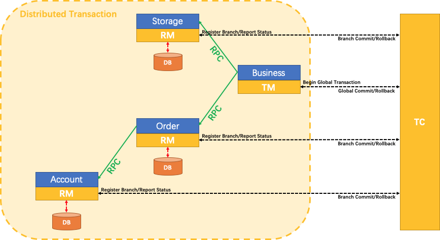

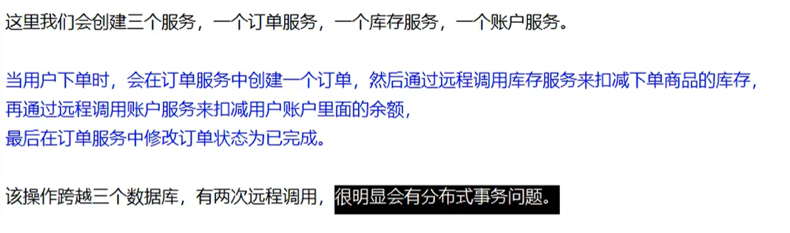


db_undo_log.sql  日志回滚表


#### @GlobalTransactional 注解

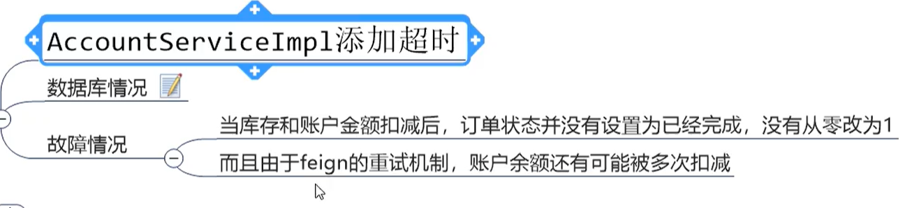


http://localhost:2001/order/create?userId=1&productId=1&count=10&money=100

超时异常返回error page，并且数据库不会进行插入操作

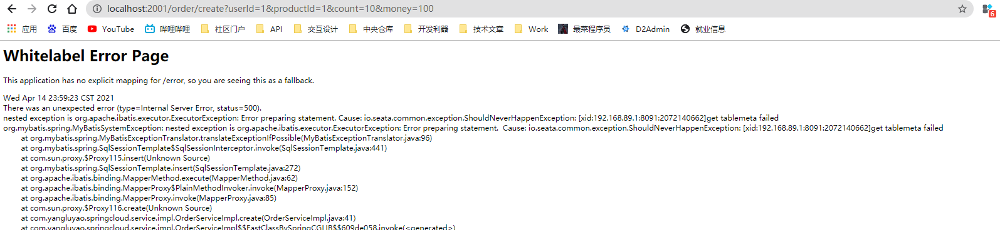

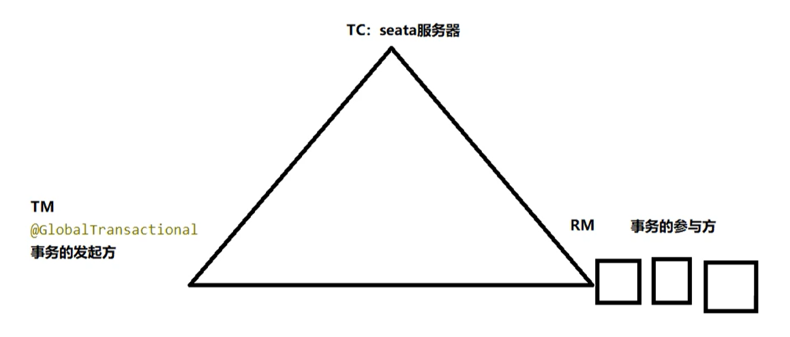

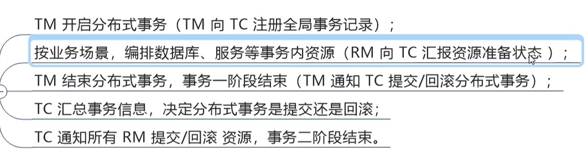

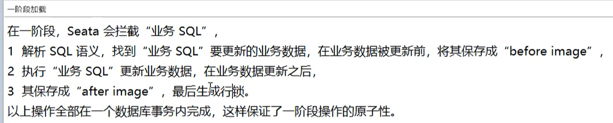

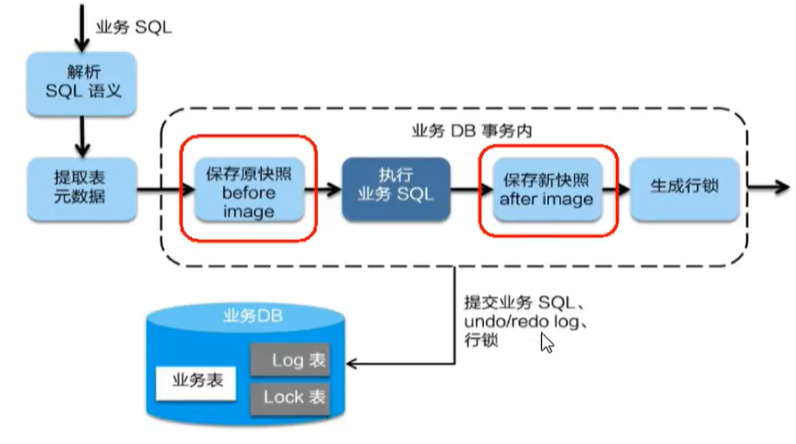

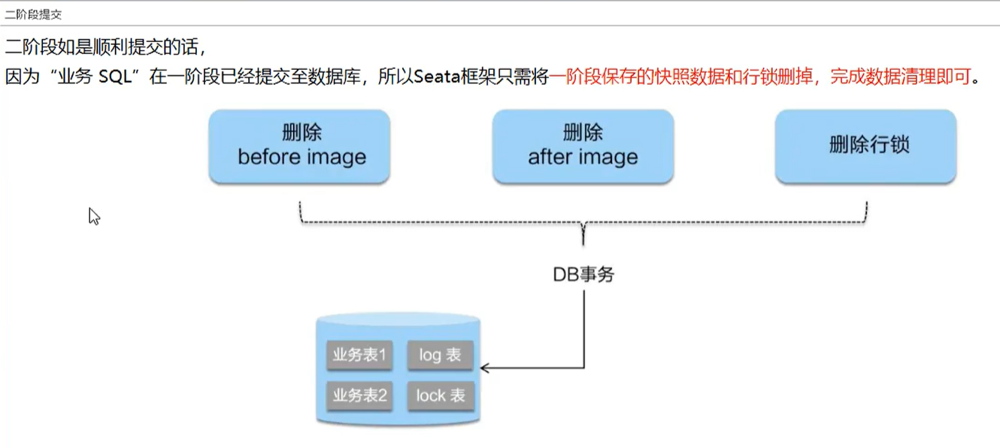

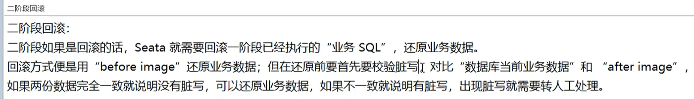

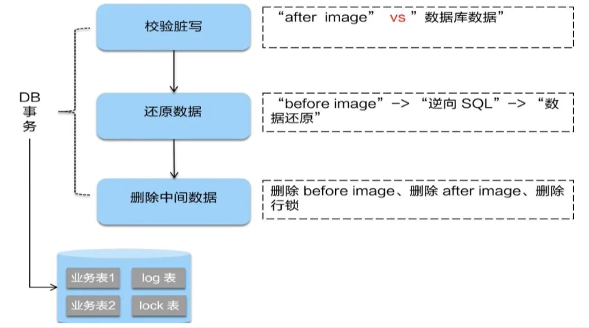

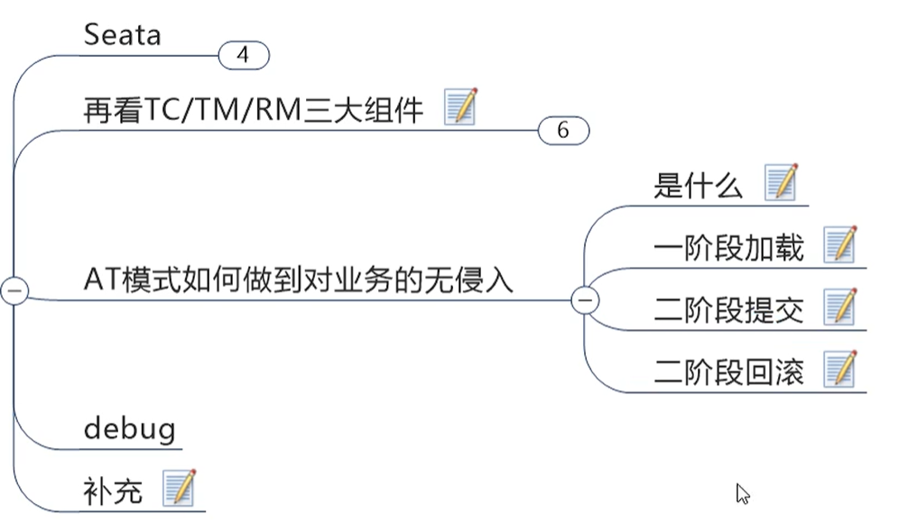

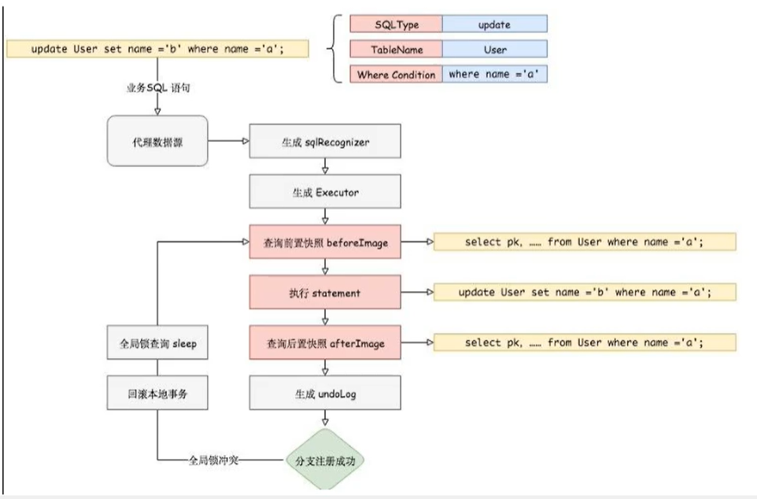

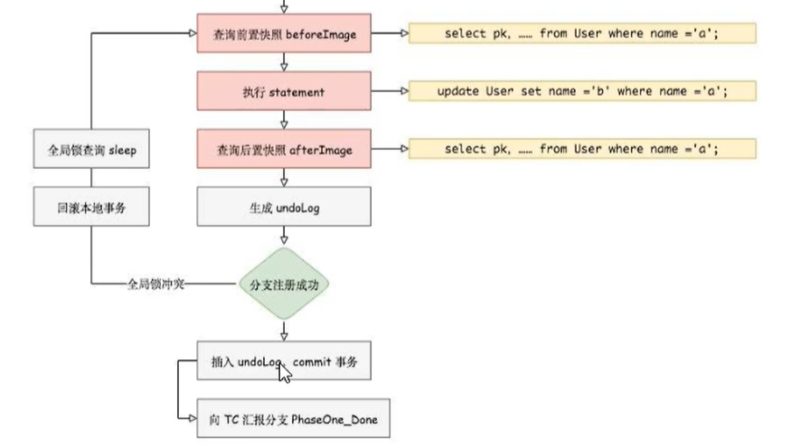


