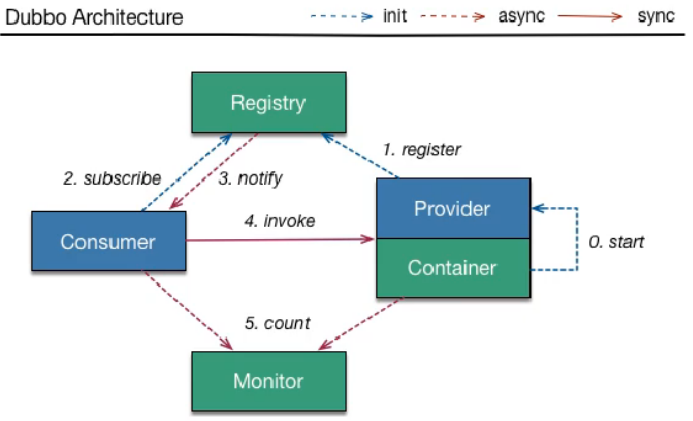
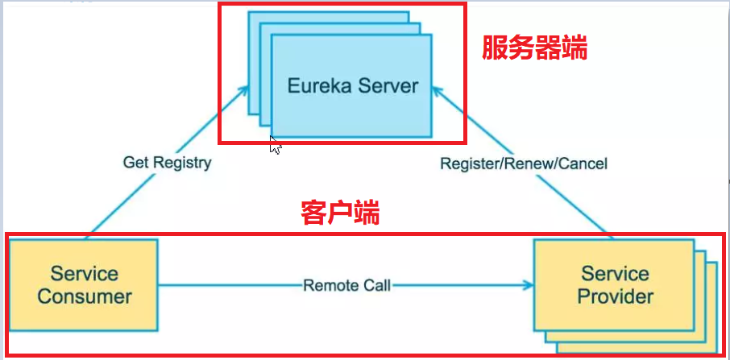
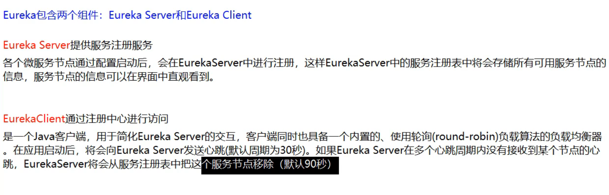
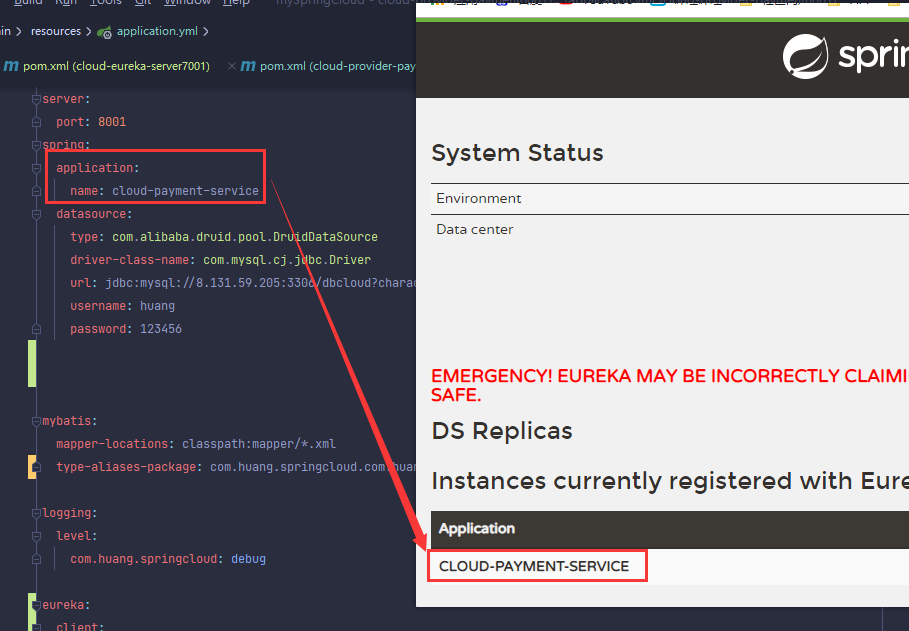
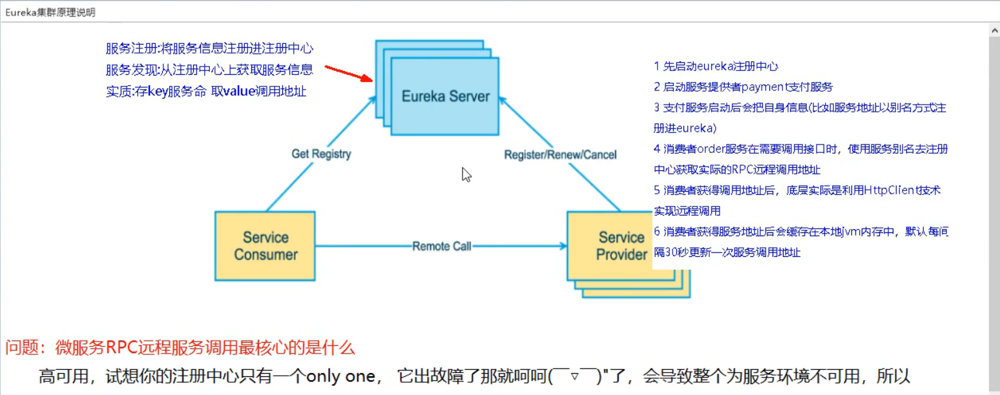
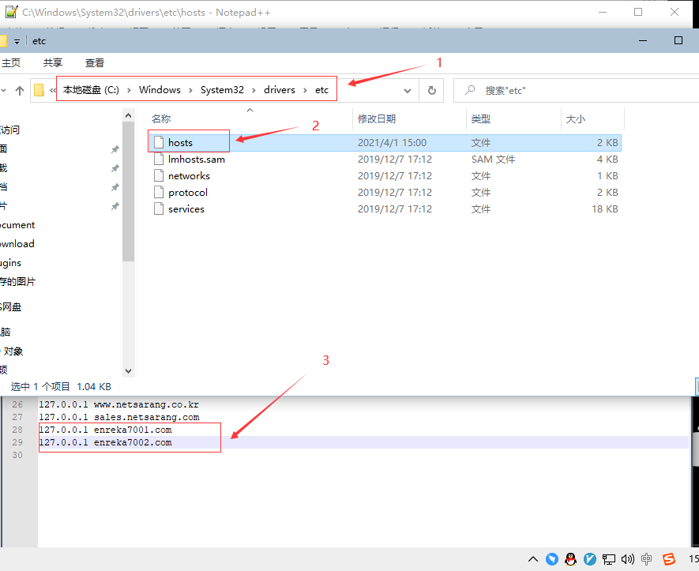
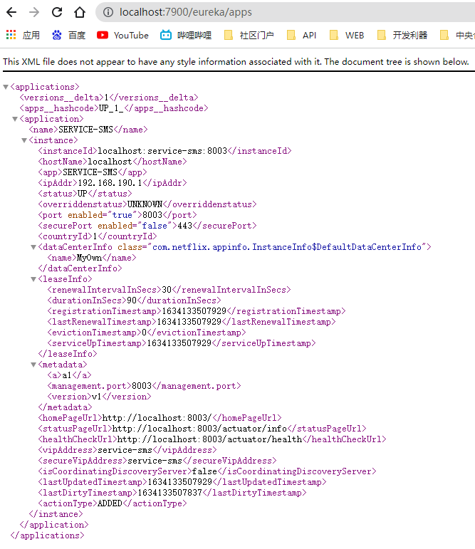

### Eureka项目介绍

官方文档：https://github.com/Netflix/eureka/wiki













解决办法：搭建Eureka注册中心集群，实现负载均衡+故障容错


> 模拟多台机器：

做集群：

修改host 文件



测试：

http://enreka7001.com:7001/

http://localhost:7001/

##### eureka元数据信息：

http://localhost:7900/eureka/apps



### Eureka项目启动

##### server端

```xml
# 1.pom文件
<dependency>
	<groupId>org.springframework.cloud</groupId>
	<artifactId>spring-cloud-starter-netflix-eureka-server</artifactId>
</dependency>

# 2.开启注解
@EnableEurekaServer

# 3.配置文件
spring:
  application:
    name: eureka
eureka:
  client:
    register-with-eureka: false
    fetch-registry: true
    service-url:
      defaultZone: http://eureka-7900:7900/eureka/
  server:
    # 自我保护
    enable-self-preservation: true
    # 自我保护阈值
    renewal-percent-threshold: 0.85
    # 删除服务的时间间隔
    eviction-interval-timer-in-ms: 10000
    # 关闭从readOnly读注册表
    use-read-only-response-cache: false
    # readWrite 和 readOnly 同步时间间隔
    response-cache-update-interval-ms: 1000

---
server:
  port: 7900
eureka:
  instance:
    hostname: eureka-7900
spring:
  config:
    activate:
      on-profile: 7900


---
server:
  port: 7901
eureka:
  instance:
    hostname: eureka-7901
spring:
  config:
    activate:
      on-profile: 7901


---
server:
  port: 7902
eureka:
  instance:
    hostname: eureka-7902
spring:
  config:
    activate:
      on-profile: 7902

```

##### client端

```
# 1.pom
<dependency>
    <groupId>org.springframework.cloud</groupId>
    <artifactId>spring-cloud-starter-netflix-eureka-client</artifactId>
</dependency>

# 2.配置文件

eureka:
  client:
    service-url:
      defaultZone: http://localhost:7900/eureka/
    # 注册表获取间隔秒
    registry-fetch-interval-seconds: 30
    # 是否注入服务
    enabled: true

  instance:
#    prefer-ip-address: true
#    ip-address: 127.0.0.1
    # 续约时长
    lease-renewal-interval-in-seconds: 10
```


### Eureka配置文件详解

以下配置都是以 `eureka.server` 开头：

##### server参数配置：

[博客]: https://blog.csdn.net/whiteForever/article/details/81480354?ops_request_misc=%257B%2522request%255Fid%2522%253A%2522163367994616780271589072%2522%252C%2522scm%2522%253A%252220140713.130102334.pc%255Fall.%2522%257D&amp;request_id=163367994616780271589072&amp;biz_id=0&amp;utm_medium=distribute.pc_search_result.none-task-blog-2~all~first_rank_ecpm_v1~rank_v31_ecpm-2-81480354.first_rank_v2_pc_rank_v29&amp;utm_term=+you+should+set+property+%27eureka.server.peer-node-read-timeout-ms%27+to+a+bigger+value&amp;spm=1018.2226.3001.4187	" 博客"


| 参数                                        | 描述                         | 备注       |
| ------------------------------------------- | ---------------------------- | ---------- |
| eureka.server.eviction-interval-timer-in-ms | server清理无效节点的时间间隔 | 默认60秒   |
| eureka.server.enable-self-preservation      | 是否开启自我保护，默认true   | true false |
| eureka.server.renewal-percent-threshold     | 开启自我保护的系数           | 默认：0.85 |

##### client参数配置：

|                                                        |                                |               |
| ------------------------------------------------------ | ------------------------------ | ------------- |
| 参数                                                   | 描述                           | 备注          |
| eureka.client.enabled                                  | 是否开启client，默认true       | true false    |
| eureka.client.register-with-eureka                     | 是否注册                       | 默认true      |
| eureka.client.fetch-registry                           | 是否检索服务                   | true false    |
| eureka.client.serviceUrl.defaultZone                   | 默认服务注册中心地址           | 多个用","隔开 |
| eureka.client.eureka-server-connect-timeout-seconds    | 连接server服务器超时时间       | 默认5秒       |
| eureka.client.eureka-connection-idle-timeout-seconds   | 连接server的连接空闲时长       | 默认30秒      |
| eureka.client.eureka-server-read-timeout-seconds       | 连接server读取数据超时时间     | 默认8秒       |
| eureka.client.eureka-server-total-connections          | 连接server的最大连接数         | 默认200       |
| eureka.client.eureka-server-total-connections-per-host | 对单个server的最大连接数       | 默认50        |
| eureka.client.eureka-service-url-poll-interval-seconds | 获取集群中最新的server节点数据 | 默认0         |
| eureka.client.heartbeat-executor-thread-pool-size      | client维持与server的心跳线程数 | 默认2         |
| eureka.client.service-url                              | 列出所有可用注册中心的地址     |               |

##### instance参数配置：

|                                                      |                                      |                                                              |
| ---------------------------------------------------- | ------------------------------------ | ------------------------------------------------------------ |
| 参数                                                 | 描述                                 | 备注                                                         |
| eureka.instance.lease-renewal-interval-in-seconds    | 服务续约任务调用间隔时间，默认30秒   | client每隔30秒向server上报自己状态，避免被server剔除         |
| eureka.instance.lease-expiration-duration-in-seconds | 服务时效时间，默认90秒               | 当server 90秒内没有收到client的注册信息时，会将该节点剔除    |
| eureka.client.registry-fetch-interval-seconds        | client本地缓存清单更新间隔，默认30秒 | client每隔30秒，向server请求可用服务清单。对于API网关类应用，可以适当降低时间间隔 |
| eureka.instance.prefer-ip-address                    | 注册服务时是否使用IP注册，默认false  | true false                                                   |
| eureka.instance.ip-address                           | server端的ip地址                     |                                                              |
| eureka.instance.hostname                             | server端的hostname                   | 默认localhost                                                |
| eureka.instance.instance-id                          | 注册到server的实例                   |                                                              |


