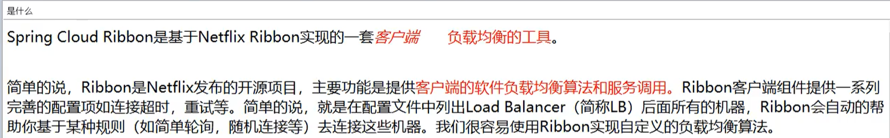
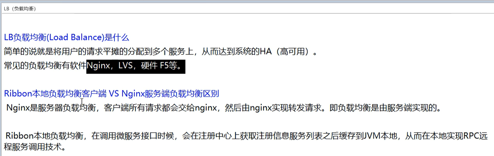
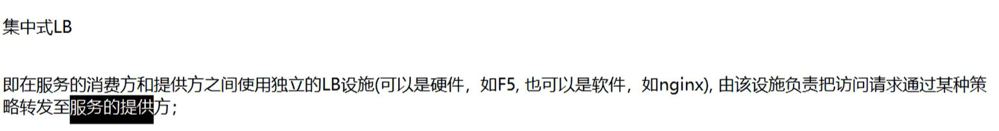
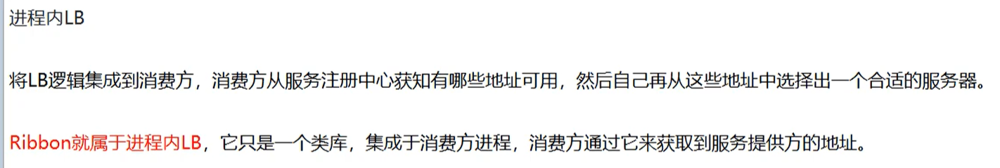
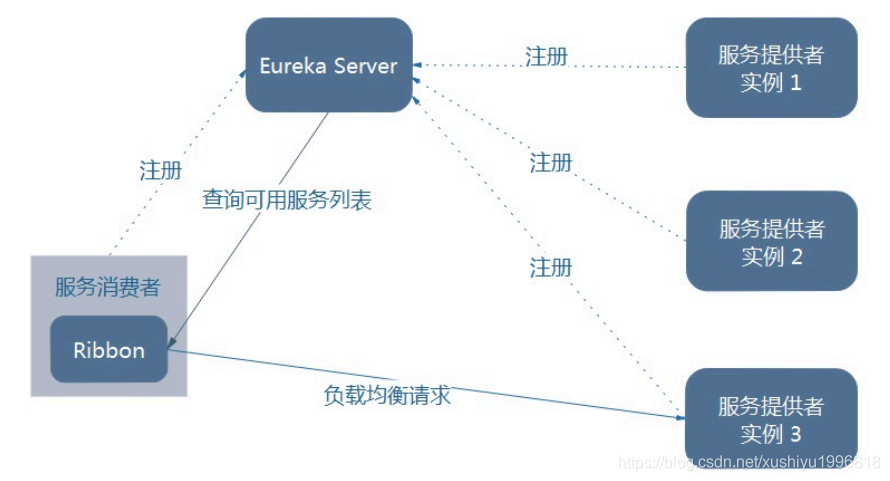
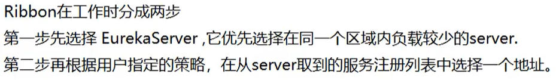
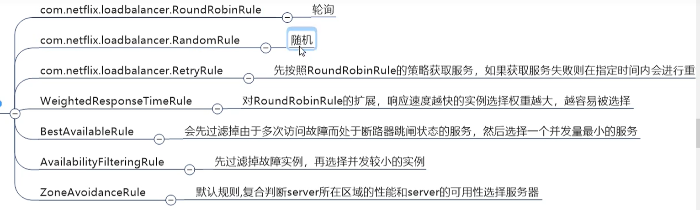
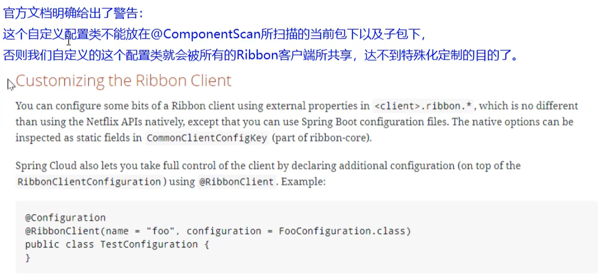
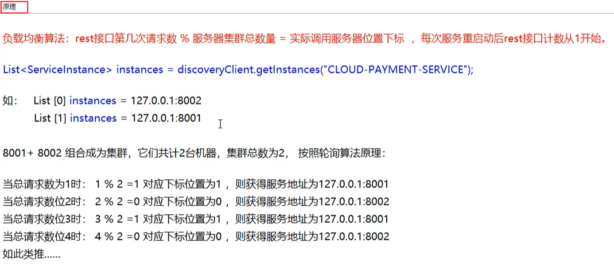

# Ribbon 初体验

### 介绍

Spring Cloud Ribbon是基于Netflix Ribbon实现的一套***==客户端    负载均衡的工具==***

  

 

```java
@Configuration
public class Config {

    @Bean
    @LoadBalanced   // RestTemplate 已经被 Ribbon 代理
    public RestTemplate restTemplate(){
        return new RestTemplate();
    }
}


@RestController
public class DeptController_Consumer {
	
	private static final String REST_URL_PREFIX = "http://MICROSERVICECLOUD-DEPT";

	@Autowired
	private RestTemplate restTemplate;

	@RequestMapping(value = "/consumer/dept/add")
	public boolean add(Dept dept) {
		return restTemplate.postForObject(REST_URL_PREFIX + "/dept/add", dept, Boolean.class);
	}
	@RequestMapping(value = "/consumer/dept/get/{id}")
	public Dept get(@PathVariable("id") Long id) {
		return restTemplate.getForObject(REST_URL_PREFIX + "/dept/get/" + id, Dept.class);
	}	
	@RequestMapping(value = "/consumer/dept/list")
	public List<Dept> list() {
		return restTemplate.getForObject(REST_URL_PREFIX + "/dept/list", List.class);
	}
}

```



官网：https://github.com/Netflix/ribbon/wiki/Getting-Started

已进入维护模式







ribbon 架构





iRule:根据特点算法中的服务列表中选取一个要访问的服务








## 实现自定义负载均衡算法


