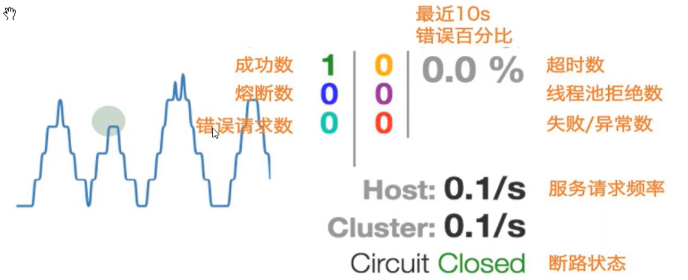

## Hystrix 断路器

### 概述

官网：https://github.com/Netflix/Hystrix/wiki


### 重要概念

#### 服务降级

**概念：**服务器忙，请稍后再试，不让客户端等待并立刻返回一个友好提示，fallback


#### 服务熔断

**概念：**类比保险丝达到最大服务访问后，直接拒绝访问，拉闸限电，然后调用服务降级的方法并返回友好提示

服务的降级->进而熔断->恢复调用链路

#### 服务限流

**概念；**秒杀高并发等操作，严禁一窝蜂的过来拥挤，大家排队，一秒钟N个，有序进行


### 案例


问题


解决思路


优化


服务降级之后，服务恢复无法重新连接


#### 服务监控


```xml
<dependency>
    <groupId>org.springframework.cloud</groupId>
    <artifactId>spring-cloud-starter-netflix-hystrix-dashboard</artifactId>
</dependency>http://localhost:9001/hystrix
```





