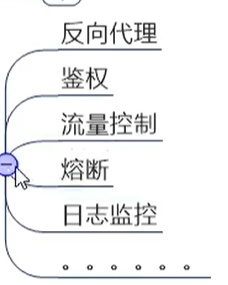
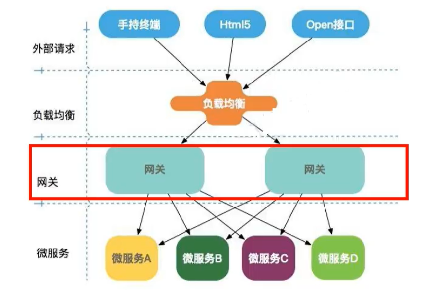
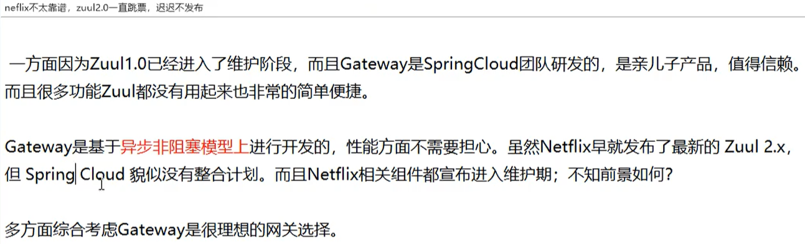
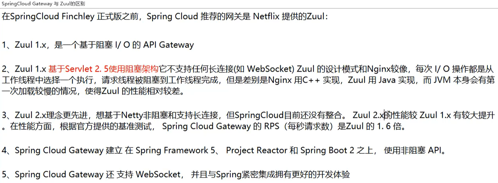
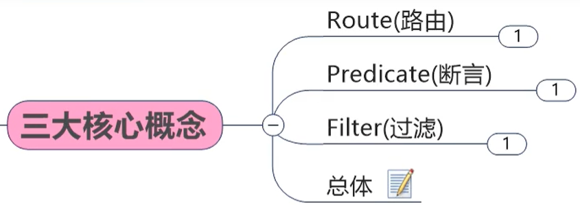
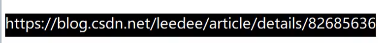
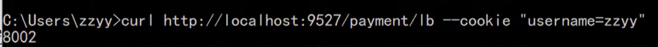

## GateWay 和 Zuul












断言的不同类型：

```
- Path=/payment/get/** # 断言，路径相匹配的进行路由
  #- After=2017-01-20T17:42:47.789-07:00[America/Denver]
  #- Before=2017-01-20T17:42:47.789-07:00[America/Denver]
  #- Cookie=username,zzyy
  #- Header=X-Request-Id, \d+ #请求头要有X-Request-Id属性，并且值为正数
  #- Host=**.atguigu.com
  #- Method=GET
  #- Query=username, \d+ # 要有参数名username并且值还要是正整数才能路由
```


#### cookie：

curl 命令：






