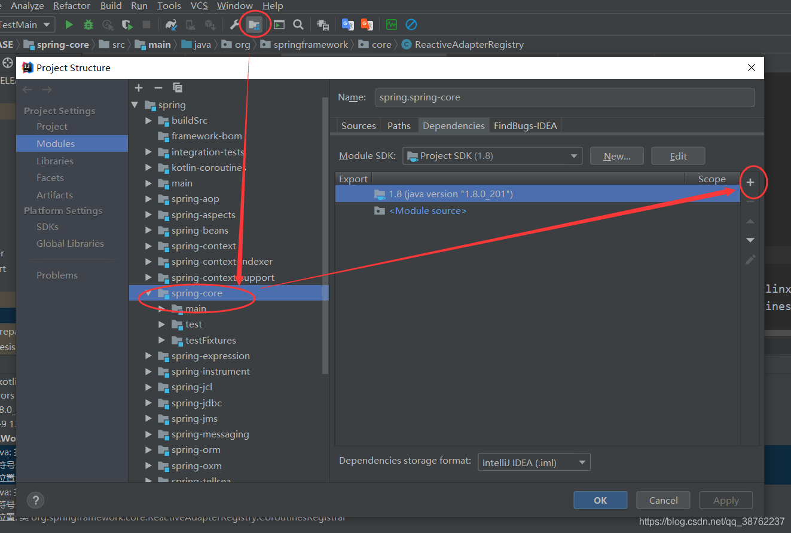

[gradle下载仓库]( https://services.gradle.org/distributions/)

https://docs.gradle.com/enterprise/compatibility/

https://blog.csdn.net/java_lyvee/article/details/107300648

https://github.com/spring-projects/spring-framework/blob/main/import-into-idea.md

https://www.cnblogs.com/qubo520/p/13264036.html  

https://www.csdn.net/tags/MtTaEgxsNTI1MDUwLWJsb2cO0O0O.html

[比较完整]解决各种问题：https://blog.csdn.net/qq_38762237/article/details/107815524


```properties
distributionUrl=file:///E:/configuration/gradle/gradle-6.5.1-all.zip

maven { url 'https://maven.aliyun.com/nexus/content/groups/public/' }
maven { url 'https://maven.aliyun.com/nexus/content/repositories/jcenter' }
mavenCentral()
maven { url "https://repo.spring.io/libs-spring-framework-build" }
maven { url "https://repo.spring.io/milestone" } // Reactor
//新增spring插件库
maven { url "https://repo.spring.io/plugins-release" }

```

### 源码springboot/spring 源码步骤

1. 修改下载源
    gradle\wrapper中的配置文件gradle-wrapper.properties

```properties
	distributionBase=GRADLE_USER_HOME
	distributionPath=wrapper/dists
	#distributionUrl这个换成自己本地gradle-7.0.2-bin.zip地址
	#distributionUrl=https\://services.gradle.org/distributions/gradle-6.9-bin.zip
	distributionUrl=file:///E:/soft/gradle-7.0.2-bin.zip
	zipStoreBase=GRADLE_USER_HOME
	zipStorePath=wrapper/dists
```

2.buildSrc下的build.gradle ，需要修改这两个地方

```properties
plugins {
	id "java-gradle-plugin"
	//id "io.spring.javaformat" version "${javaFormatVersion}"
	id "checkstyle"
}

repositories {
	maven { url 'https://maven.aliyun.com/nexus/content/groups/public/' }
	maven { url 'https://maven.aliyun.com/nexus/content/repositories/jcenter' }
	maven { url "https://repo.spring.io/plugins-release" }
	mavenCentral()
	gradlePluginPortal()
	maven { url "https://repo.spring.io/release" }
}
```

3.buildSrc下的settings.gradle，修改这一个地方

```
repositories {
		maven { url 'https://maven.aliyun.com/nexus/content/groups/public/' }
		maven { url 'https://maven.aliyun.com/nexus/content/repositories/jcenter' }
		maven { url "https://repo.spring.io/plugins-release" }
		mavenCentral()
		gradlePluginPortal()
	}
```

4.工程根目录下的build.gradle，添加一个，修改一处

```
// 添加这个，放在第一行
buildscript {
	repositories {
		maven { url 'https://maven.aliyun.com/nexus/content/groups/public/' }
		maven { url 'https://maven.aliyun.com/nexus/content/repositories/jcenter' }
		maven { url "https://repo.spring.io/plugins-release" }
	}
}

allprojects {
	group "org.springframework.boot"

	repositories {
		maven { url 'https://maven.aliyun.com/nexus/content/groups/public/' }
		maven { url 'https://maven.aliyun.com/nexus/content/repositories/jcenter' }
		mavenCentral()
		if (version.contains('-')) {
			maven { url "https://repo.spring.io/milestone" }
		}
		if (version.endsWith('-SNAPSHOT')) {
			maven { url "https://repo.spring.io/snapshot" }
		}
	}

	configurations.all {
		resolutionStrategy.cacheChangingModulesFor 0, "minutes"
	}
}
```

5.工程根目录下的seetings.gradle，修改一处

```groovy
repositories {
		maven { url 'https://maven.aliyun.com/nexus/content/groups/public/' }
		maven { url 'https://maven.aliyun.com/nexus/content/repositories/jcenter' }
		mavenCentral()
		gradlePluginPortal()
		maven {
			url 'https://repo.spring.io/plugins-release'
		}
		if (version.endsWith('-SNAPSHOT')) {
			maven { url "https://repo.spring.io/snapshot" }
		}
	}
```

6.指定idea中gradle下载路径，这里最好要指定下，因为默认会下载到C盘用户目录下，项目依赖比较大，实测下完需要2G。


### 报错问题汇总

### （1）报错：找不到CoroutinesUtils

找到`spring-core\kotlin-coroutines\build\libs\kotlin-coroutines-5.2.8.RELEASE.jar`，右键 Add As Library，然后点开IDEA上方工具栏，Build - Rebuild Project，没有效果则关闭项目重新打开再点击Rebuild Project，简单粗暴


或者执行以下操作，实际上是一样的效果， 就是将jar添加到模块中



### （2）报错：缺少spring-cglib-repack-3.3.0.jar，spring-objenesis-repack-3.1.jar

spring-core缺少spring-cglib-repack-3.3.0.jar，spring-objenesis-repack-3.1.jar

找到 Gradle>spring-core>Tasks>other下面的两个工具，双击运行


把原来报错的两个jar删除，保留新导入的本地jar即可，效果图如下


### （3）报错：Aspectj Error:(38, 38) java: 程序包org.springframework.aop.target不存在

问题原因是spring源码的AOP使用了aspectJ ，而java不识别aspectJ
用迅雷下载（因为快）AspectJ：https://www.eclipse.org/aspectj/downloads.php

`java -jar aspectj-1.9.6.jar` 运行下载的jar进行安装


添加两个

- AspectJ(spring.spring-aop.main)
- AspectJ(spring.spring-aspects.main)


修改AspectJ编译的方式


### （4）报错：找不到 import org.springframework.aop.target.SingletonTargetSource;

首先，打开类spring-aop\src\main\java\org\springframework\aop\framework\AopProxyUtils.java发现报错，
报错找不到import org.springframework.aop.target.SingletonTargetSource;，网上没人解决这个问题，我是和同时讨论之间找到解决方法的。

在Windows下查看该目录spring-aop\src\main\java\org\springframework\aop\target是存在的，但是在idea中显示不出来

解决方法：File–>Settings–>Editor–>File Types–>右边Ignore files and folders找到target文件名去掉即可


### 附：spring源代码各个模块作用

主要模块：

spring-core:核心模块 依赖注入IOC和DI的最基本实现
spring-beans:Bean工厂与装配
spring-context:上下文，即IOC容器
spring-context-support:对IOC的扩展，以及IOC子容器
spring-context-indexer:类管理组件和Classpath扫描
spring-expression:表达式语句

切面编程：

spring-aop:面向切面编程，CGLIB,JDKProxy
spring-aspects:集成AspectJ，Aop应用框架
spring-instrument:动态Class Loading模块

数据访问与集成：

spring-jdbc:提供JDBC主要实现模块，用于简化JDBC操作
spring-tx:spring-jdbc事务管理
spring-orm:主要集成Hibernate,jpa,jdo等
spring-oxm:将java对象映射成xml数据或将xml映射为java对象
spring-jms:发送和接受消息

web组件：

spring-web:提供了最基础的web支持，主要建立在核心容器上
spring-webmvc:实现了spring mvc的web应用
spring-websocket:主要与前端页的全双工通讯协议
spring-webflux:一个新的非阻塞函数式Reactive Web框架

报文：

spring-messaging:4.0加入的模块，主要集成基础报文传送应用

测试：

spring-test：测试组件

集成兼容：

spring-framework-bom:解决不同模块依赖版本不同问题

