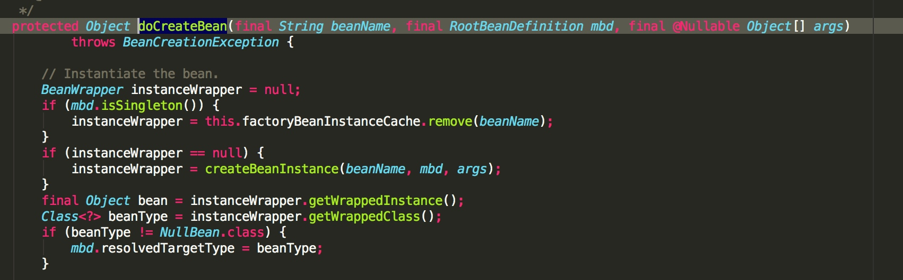
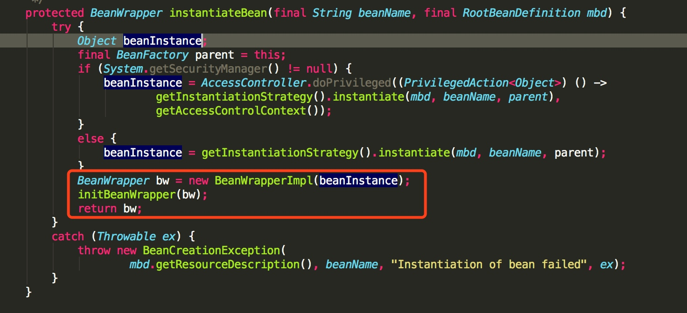

# SPRING 分析总结

## 第一节  Processor相关类

### BeanPostProcessor

```java
public interface BeanPostProcessor {

  // 总结：根据注释来看是在 新bean初始化之前回调afterPropertiesSet进行属性填充
   default Object postProcessBeforeInitialization(Object bean, String beanName) throws BeansException {
      return bean;
   }

   // 总结：再任意bean初始化（如 InitializingBean 的 afterPropertiesSet 或自定义 init 方法）之后回调执行此方法
   default Object postProcessAfterInitialization(Object bean, String beanName) throws BeansException {
      return bean;
   }

}

```

**总结：** Bean的后置处理器接口，在依赖注入的初始化方法前后进行调用，允许自定义修改新 bean 实例的工厂挂钩 - 例如，检查标记接口或使用代理包装 bean。

> ApplicationContext 可以在其 bean 定义中自动检测 BeanPostProcessor bean，并将这些后处理器应用于随后创建的任何 bean。一个普通的  BeanFactory  允许以编程方式注册后处理器，将它们应用于通过 bean 工厂创建的所有 bean。


类列举

- InstantiationAwareBeanPostProcessor


### BeanFactoryPostProcessor 

```java
@FunctionalInterface
public interface BeanFactoryPostProcessor {
	
  //在标准初始化之后修改应用程序上下文的内部 bean 工厂。所有 bean 定义都将被加载，但还没有 bean 被实例化。这允许覆盖或添加属性，甚至是急切初始化的 bean。
	void postProcessBeanFactory(ConfigurableListableBeanFactory beanFactory) throws BeansException;

}
```

 **总结**


###  BeanDefinitionRegistryPostProcessor

```java
public interface BeanDefinitionRegistryPostProcessor extends BeanFactoryPostProcessor {

	//在标准初始化之后修改应用程序上下文的内部 bean 定义注册表。
	//所有常规 bean 定义都将被加载，但尚未实例化任何 bean。这允许在下一个后处理阶段开始之前添加更多的 bean 定义。
	void postProcessBeanDefinitionRegistry(BeanDefinitionRegistry registry) throws BeansException;

}
```

**总结**

它继承与 BeanFactoryPostProcessor ， 主要用于操作 BeanDefinition ，提前初始化


==ConfigurationClassPostProcessor== 类 继承自 它， 用于解析 @Configuration 注解 ，实现自动装配


## 第二节  BeanFactory 和 FactoryBean

### BeanFactory

```java
public interface BeanFactory {

	String FACTORY_BEAN_PREFIX = "&";

	Object getBean(String name) throws BeansException;

	\<T\> T getBean(String name, Class\<T\> requiredType) throws BeansException;

	Object getBean(String name, Object... args) throws BeansException;

	\<T\> T getBean(Class\<T\> requiredType) throws BeansException;

	\<T\> T getBean(Class\<T\> requiredType, Object... args) throws BeansException;

	\<T\> ObjectProvider\<T\> getBeanProvider(Class\<T\> requiredType);

	\<T\> ObjectProvider\<T\> getBeanProvider(ResolvableType requiredType);

	boolean containsBean(String name);

	boolean isSingleton(String name) throws NoSuchBeanDefinitionException;

	boolean isPrototype(String name) throws NoSuchBeanDefinitionException;

	boolean isTypeMatch(String name, ResolvableType typeToMatch) throws NoSuchBeanDefinitionException;

	boolean isTypeMatch(String name, Class<?> typeToMatch) throws NoSuchBeanDefinitionException;

	Class<?> getType(String name) throws NoSuchBeanDefinitionException;

	Class<?> getType(String name, boolean allowFactoryBeanInit) throws NoSuchBeanDefinitionException;

	String[] getAliases(String name);

}
```

**总结：** BeanFactory 完整切严格的执行bean的生命周期


### FactoryBean\\<T\>

```java 
public interface FactoryBean\<T\> {

	String OBJECT_TYPE_ATTRIBUTE = "factoryBeanObjectType";

	@Nullable
	T getObject() throws Exception;

	@Nullable
	Class<?> getObjectType();

	default boolean isSingleton() {
		return true;
	}

}

```

**总结：** 可以不需要走完完整的bean生命周期


## 第三节  BeanWrapper 

### BeanWrapper

```Java
public interface BeanWrapper extends ConfigurablePropertyAccessor {

	void setAutoGrowCollectionLimit(int autoGrowCollectionLimit);
	int getAutoGrowCollectionLimit();

	Object getWrappedInstance();
	Class<?> getWrappedClass();

	PropertyDescriptor[] getPropertyDescriptors();
	PropertyDescriptor getPropertyDescriptor(String propertyName) throws InvalidPropertyException;

}
```

- 可以将它理解为一个低级Bean ，它主要用于spring 通多代理创建bean的实例之后进行了一次包装，然后通过BeanWrapper 对 对象进行属性的填充

主要作用代码如下：



所以这里 BeanWrapper 是一个从 BeanDefinition 到 Bean 直接的**中间产物**，我们可以称它为”低级 bean“。在一般情况下，我们不会在实际项目中用到它。BeanWrapper 是 Spring 框架中重要的组件类，它就相当于一个代理类，Spring 委托 BeanWrapper 完成 Bean 属性的填充工作。在 Bean 实例被 InstantiationStrategy 创建出来后，Spring 容器会将 Bean 实例通过 BeanWrapper 包裹起来，是通过如如下代码实现：



**核心方法：**

- `#getWrappedInstance()` 方法：获取包装对象的实例。
- `#getWrappedClass()` 方法：获取包装对象的类型。
- `#getPropertyDescriptors()` 方法：获取包装对象所有属性的 PropertyDescriptor 就是这个属性的上下文。
- `#getPropertyDescriptor(String propertyName)` 方法：获取包装对象指定属性的上下文。


<u>BeanWrapper 主要继承三个核心接口：**PropertyAccessor、PropertyEditorRegistry、TypeConverter**。</u>

#### PropertyAccessor

> 可以访问属性的通用型接口（例如对象的 bean 属性或者对象中的字段），作为 BeanWrapper 的基础接口。

```java
// PropertyAccessor.java

public interface PropertyAccessor {

    String NESTED_PROPERTY_SEPARATOR = ".";
    char NESTED_PROPERTY_SEPARATOR_CHAR = '.';

    String PROPERTY_KEY_PREFIX = "[";
    char PROPERTY_KEY_PREFIX_CHAR = '[';

    String PROPERTY_KEY_SUFFIX = "]";
    char PROPERTY_KEY_SUFFIX_CHAR = ']';

    boolean isReadableProperty(String propertyName);

    boolean isWritableProperty(String propertyName);

    Class<?> getPropertyType(String propertyName) throws BeansException;
    TypeDescriptor getPropertyTypeDescriptor(String propertyName) throws BeansException;
    Object getPropertyValue(String propertyName) throws BeansException;

    void setPropertyValue(String propertyName, @Nullable Object value) throws BeansException;
    void setPropertyValue(PropertyValue pv) throws BeansException;
    void setPropertyValues(Map<?, ?> map) throws BeansException;
    void setPropertyValues(PropertyValues pvs) throws BeansException;
    void setPropertyValues(PropertyValues pvs, boolean ignoreUnknown)
    throws BeansException;
    void setPropertyValues(PropertyValues pvs, boolean ignoreUnknown, boolean ignoreInvalid)
    throws BeansException;
}
```

就上面的源码我们可以分解为四类方法：

- `#isReadableProperty(String propertyName)` 方法：判断指定 property 是否可读，是否包含 getter 方法。
- `#isWritableProperty(String propertyName)` 方法：判断指定 property 是否可写,是否包含 setter 方法。
- `#getPropertyType(...)` 方法：获取指定 propertyName 的类型
- `#setPropertyValue(...)` 方法：设置指定 propertyValue 。


#### PropertyEditorRegistry

> 用于注册 JavaBean 的 PropertyEditors，对 PropertyEditorRegistrar 起核心作用的中心接口。由 BeanWrapper 扩展，BeanWrapperImpl 和 DataBinder 实现。

```Java
// PropertyEditorRegistry.java

public interface PropertyEditorRegistry {
   // 《重点》
    void registerCustomEditor(Class<?> requiredType, PropertyEditor propertyEditor);

    void registerCustomEditor(@Nullable Class<?> requiredType, @Nullable String propertyPath, PropertyEditor propertyEditor);

    @Nullable
    PropertyEditor findCustomEditor(@Nullable Class<?> requiredType, @Nullable String propertyPath);

}
```

- 根据接口提供的方法，PropertyEditorRegistry 就是用于 PropertyEditor 的注册和发现，而 PropertyEditor 是 Java 内省里面的接口，用于改变指定 property 属性的类型。

注册自定义策略的接口，当您需要在几种不同的情况下使用同一组属性编辑器时，这特别有用：编写相应的注册器并在每种情况下重用它


#### TypeConverter

> 定义类型转换的接口，通常与 PropertyEditorRegistry 接口一起实现（但不是必须），但由于 TypeConverter 是基于线程不安全的 PropertyEditors ，因此 TypeConverters 本身也不被视为线程安全。
> 这里小编解释下，在 Spring 3 后，不在采用 PropertyEditors 类作为 Spring 默认的类型转换接口，而是采用 ConversionService 体系，但 ConversionService 是线程安全的，所以在 Spring 3 后，如果你所选择的类型转换器是 ConversionService 而不是 PropertyEditors 那么 TypeConverters 则是线程安全的。

```java
public interface TypeConverter {

    \<T\> T convertIfNecessary(Object value, Class\<T\> requiredType) throws TypeMismatchException;
    \<T\> T convertIfNecessary(Object value, Class\<T\> requiredType, MethodParameter methodParam)
            throws TypeMismatchException;
    \<T\> T convertIfNecessary(Object value, Class\<T\> requiredType, Field field)
            throws TypeMismatchException;

}
```


#### ConversionService

- ConfigurablePropertyAccessor
  - `#setConversionService(ConversionService conversionService)` 和 `#getConversionService()` 方法，则是用于集成 Spring 的 ConversionService 类型转换体系。


​	

#### BeanWrapperImpl

>  BeanWrapper 接口的默认实现，用于对Bean的包装，实现上面接口所定义的功能很简单包括设置获取被包装的对象，获取被包装bean的属性描述器


##  第三节  Aware 接口

```java
// 属性注入执行路径

  doCreateBean() ->
	initializeBean() ->
	applyBeanPostProcessorsBeforeInitialization() ->
	AbstractAutowireCapableBeanFactory#postProcessBeforeInitialization() ->
	ApplicationContextAwareProcessor#invokeAwareInterfaces()

```


- ApplicationContextAwareProcessor#invokeAwareInterfaces（bean） 进行aware接口的属性注入

```java
// AbstractAutowireCapableBeanFactory.java

private void invokeAwareMethods(final String beanName, final Object bean) {
	if (bean instanceof Aware) {
	    // BeanNameAware
		if (bean instanceof BeanNameAware) {
			((BeanNameAware) bean).setBeanName(beanName);
		}
		// BeanClassLoaderAware
		if (bean instanceof BeanClassLoaderAware) {
			ClassLoader bcl = getBeanClassLoader();
			if (bcl != null) {
				((BeanClassLoaderAware) bean).setBeanClassLoader(bcl);
			}
		}
		// BeanFactoryAware
		if (bean instanceof BeanFactoryAware) {
			((BeanFactoryAware) bean).setBeanFactory(AbstractAutowireCapableBeanFactory.this);
		}
	}
}
```

- 首先，判断 bean 实例是否属于 Aware 接口的范畴，如果是的话，则调用实例的 `setXxx()` 方法给实例设置 xxx 属性值，在 `#invokeAwareMethods(...)` 方法，主要是设置 beanName，beanClassLoader、BeanFactory 中三个属性值。


**部分常用的 Aware 子接口：**

- LoadTimeWeaverAware：加载Spring Bean时织入第三方模块，如AspectJ
- BeanClassLoaderAware：加载Spring Bean的类加载器
- BootstrapContextAware：资源适配器BootstrapContext，如JCA,CCI
- ResourceLoaderAware：底层访问资源的加载器
- BeanFactoryAware：声明BeanFactory
- PortletConfigAware：PortletConfig
- PortletContextAware：PortletContext
- ServletConfigAware：ServletConfig
- ServletContextAware：ServletContext
- MessageSourceAware：国际化
- ApplicationEventPublisherAware：应用事件
- NotificationPublisherAware：JMX通知
- BeanNameAware：声明Spring Bean的名字
