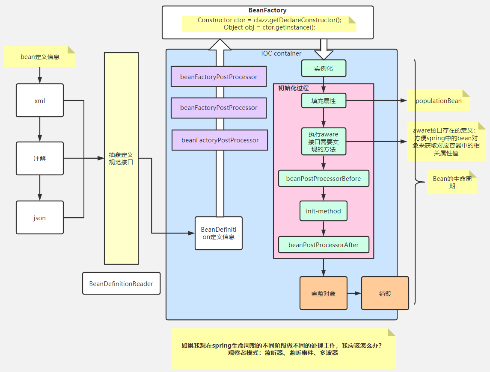
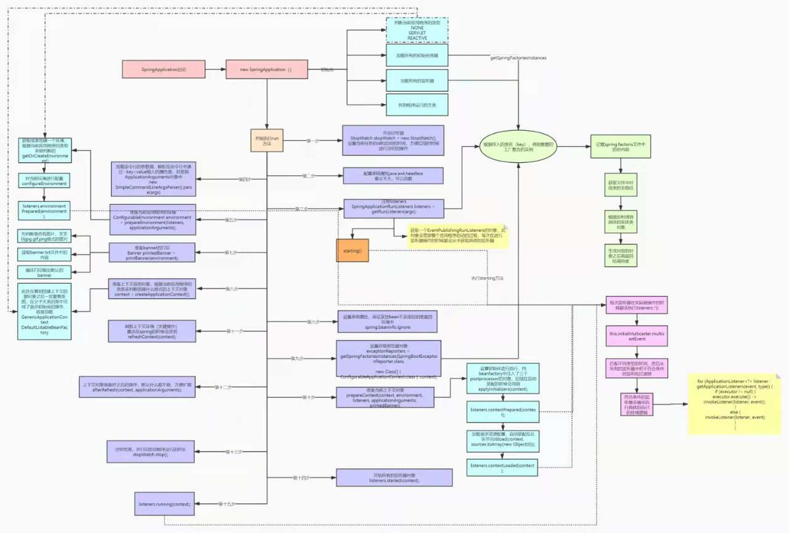

所有文档：https://docs.spring.io/spring-boot/docs

htmlsingle格式文档 [Spring Framework Reference Documentation](https://docs.spring.io/spring-framework/docs/4.0.x/spring-framework-reference/htmlsingle/)

### 事件监听机制

观察者模式

循环依赖

https://blog.csdn.net/qq_41907991/article/details/107164508?ops_request_misc=%257B%2522request%255Fid%2522%253A%2522162420075316780269873036%2522%252C%2522scm%2522%253A%252220140713.130102334.pc%255Fall.%2522%257D&request_id=162420075316780269873036&biz_id=0&utm_medium=distribute.pc_search_result.none-task-blog-2~all~first_rank_v2~rank_v29-1-107164508.pc_search_result_cache&utm_term=%E5%BE%AA%E7%8E%AF%E4%BE%9D%E8%B5%96&spm=1018.2226.3001.4187

