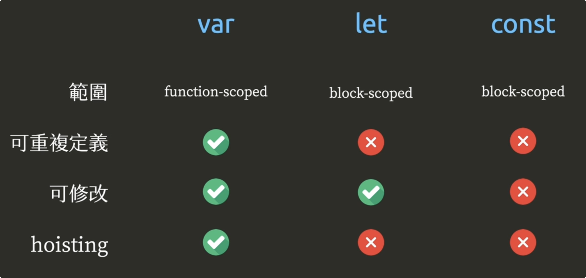

## 作用域

> 作用域（scope）指的是变量存在的范围。在 ES5 的规范中，JavaScript 只有两种作用域：
>
> 一种是全局作用域，变量在整个程序中一直存在，所有地方都可以读取；
>
> 另一种是函数作用域，变量只在函数内部存在。
>
> ES6 又新增了块级作用域.

视频：https://www.youtube.com/watch?v=Pychc22EG4Q



|            | var                 | let              | const            |
| ---------- | ------------------- | ---------------- | ---------------- |
| 范围       | **function-scoped** | **block-scoped** | **block-scoped** |
| 可重复定义 | √                   | x                | x                |
| 可修改     | √                   | √                | x                |
| hoisting   | √                   | x                | x                |


- hoisting: 提升 - 申明提升
- function-scoped - 函数范围
- block-scoped - 块范围

### var
```js
// demo 1 - hoisting
function exampleVar(){
    var x = 1
    var x = 2 // same variable
    if(true){
        console.log(x) // 2
    }
    console.log(x) // 2
}

// demo 2 - function-scoped
function func(){
    var x = 10
    console.log(x) // 10
}
func()
console.log(x) // ReferenceError
```

### let
```js
function exampleLet(){
    let x = 1
    if (true) {
        console.log(x) // error
        let x = 2 // different variable
        console.log(x) // 2
    }
    console.log(x) // 1
}
```

### const
```js
function exampleConst(){
    const x = 1
    if (true) {
        const x = 2 // different variable
        console.log(x) // 2
    }
    console.log(x) // 1
}
```


## 案例: var 和 let


```js
for(var i = 0; i < 3; i++){
    setTimeout(function(){
        console.log(i) // 3 3 3
    },100)
}
console.log(i) // 3 
// 原因 var 进行了提升


for(let i = 0; i < 3; i++){
 	 // 等于在这里  let j = i
    setTimeout(function(){
        console.log(i) // 0 1 2
    },100)
}
console.log(i) // ReferenceError
```

