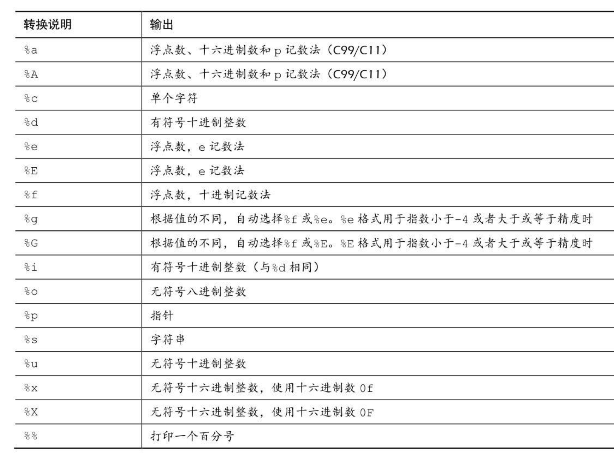
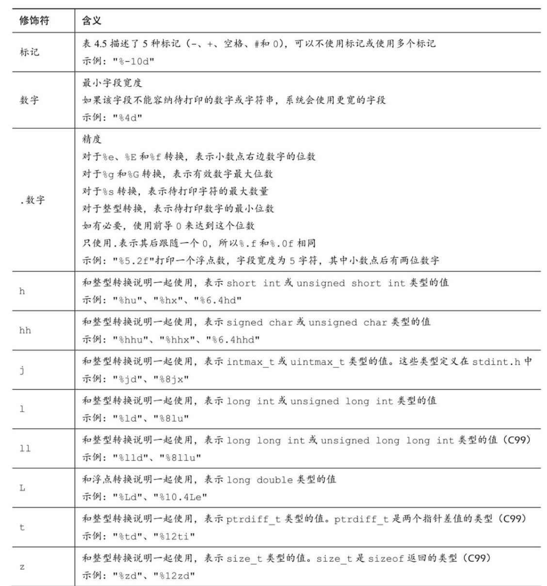
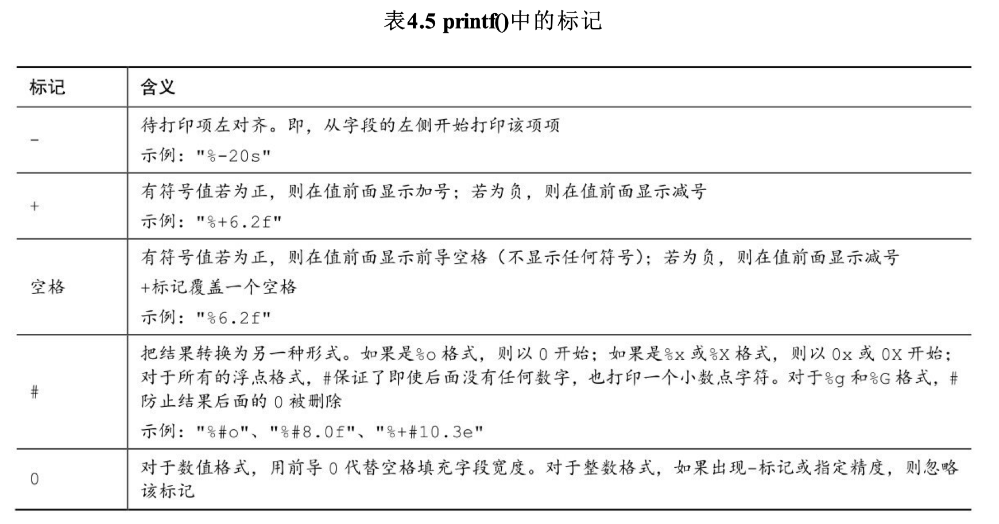

# C语言


## C语言简介

### C语言标准

##### 第1个ANSI/ISO C标准

> 美国国家标准协会 （ANSI）于 1983 年组建了一个委员会（X3J11），开发了一套新标准，并 于1989年正式公布。
>
> 该标准（ANSI C）定义了C语言和C标准库。国际标准 化组织于1990年采用了这套C标准（ISO C）。
>
> ISO C和ANSI C是完全相同的 标准。
>
> ANSI/ISO标准的最终版本通常叫作C89（因为ANSI于1989年批准该标 准）或C90（因为ISO于1990年批准该标准）。
>
> 另外，由于ANSI先公布C标 准，因此业界人士通常使用ANSI C。

##### C99标准

> 1994年，ANSI/ISO联合委员会（C9X委员会）开始修订C标准，最终发 布了C99标准。
>
> 委员会的用意不是在C语言中添加新特性，而是为了达到新的目标。 
>
> 第1个目标是，支持国际化编程。例如，提供多种方法处理国际字符集。
>
> 第2 个目标是，“调整现有实践致力于解决明显的缺陷”。因此，在遇到需要将C 移至64位处理器时，委员会根据现实生活中处理问题的经验来添加标准。
>
> 第 3个目标是，为适应科学和工程项目中的关键数值计算，提高C的适应性， 让C比FORTRAN更有竞争力。

##### C11标准

> 标准委员会在2007年承诺C标准的下一个版本是C1X，2011年终于发布了C11标准
>
> 

### 关键字

| auto     | extern   | short    | while          |
| -------- | -------- | -------- | -------------- |
| break    | float    | signed   | _Alignas       |
| case     | for      | sizeof   | _Alignof       |
| char     | goto     | static   | _Atomic        |
| const    | if       | struct   | _Bool          |
| continue | inline   | switch   | _Complex       |
| default  | int      | typedef  | _Generic       |
| do       | long     | union    | _Imaginary     |
| double   | register | unsigned | _Noreturn      |
| else     | restrict | void     | _Static_assert |
| enum     | return   | volatile | _Thread_local  |
| reserved | …        | …        | …              |


## 基础语法

### 数据类型关键字

| 最初K&R给出的关键字 | C90标准添加的关键字 | C99标准添加的关键字 |
| ------------------- | ------------------- | ------------------- |
| int                 | signed              | _Bool               |
| long                | Void                | _Complex            |
| short               |                     | _Imaginary          |
| unsigned            |                     |                     |
| char                |                     |                     |
| float               |                     |                     |
| Double              |                     |                     |


### 基本数据类型

> 1byte = 8bit  =>  1B = 8b  => 1字节 = 8 位
>
> 1KB =1024B；=8*1024b
>
> 1MB  =1024KB；=8*1024 *1024b

> 【重点背景】一般而言，储存一个int要占用一个 机器字长。
>
> **因此，早期的16位IBM PC兼容机使用16位来储存一个int值，其 取值范围（即int值的取值范围）是-32768～32767。**
>
> ISO C规定int的取值范围最小 为-32768～32767。
>
> 个人计算机上最常见的设置是，long long占64位，long占32位， short占16位，int占16位或32位（依计算机的自然字长而定）。
>
> **一般而言，long类型占用的内存比short类型大，int类型的宽度要么和 long类型相同，要么和short类型相同。**
>
> 例如，旧DOS系统的PC提供16位的 short和int，以及32位的long；Windows 95系统提供16位的short以及32位的int 和long。

| 类型        | 字节 | 范围                                        | 备注                                                         |
| ----------- | ---- | ------------------------------------------- | ------------------------------------------------------------ |
| Char        | 1    |                                             | 有些编译器使用有符号的char，而有些则 使用无符号的char。<br />在需要时，可在char前面加上关键字signed或unsigned来 指明具体使用哪一种类型。 |
| int         | 4    | -2147483648 - 2147483647 <br>0 - 4294967295 | 系统给定的基本整数类型。<br />C语言规定int类型不小于16位。<br />也就是2字节，[-32768～32767] |
| Short       | 2    | −32767 - 32767                              | **= short int**<br />最大的short类型整数小于或等于最大的int类型整 数。<br />C语言规定short类型至少占16位。 |
| long        | 8    | -9223372036854775808 - 9223372036854775807  | **= long int**<br />该类型可表示的整数大于或等于最大的int类型整数。 C语言规定long类型至少占32位。 |
| long long   | 8    |                                             | **= long long int**<br /><br />该类型可表示的整数大于或等于最大的long 类型整数。Long long类型至少占64位。 |
| float       | 4    |                                             | 系统的基本浮点类型，可精确表示至少6位有效数字。              |
| double      | 8    |                                             | 储存浮点数的范围（可能）更大，能表示比 float 类型更多 的有效数字（至少 10位，通常会更多）和更大的指数。 |
| long double | 16   |                                             | C90新增，储存浮点数的范围（可能）比double更大，能表示比 double更多的有效数字和更大的指数。 |

> 注意，因为C语言定义了char类型是1字节，所以char类型的大 小一定是1字节。而在char类型为16位、double类型为64位的系统中，sizeof 给出的double是4字节。
>
> 在limits.h和float.h头文件中有类型限制的相关信息

```v
/* size.c -- 打印类型大小 */
#include <stdio.h>
int main(void)
{
	/* C99 为类型大小提供 %zd 转换说明 */
	printf(" char : %zd bytes.\n", sizeof(char));
	size_t si = sizeof(int); /* C99 和C11提供%zd转换说明匹配sizeof的返回类型(size_t)  一些不支持C99和C11的 编译器可用%u或%lu代替%zd。*/
	printf(" int : %zd bytes.\n", si);
	printf(" short : %zd bytes.\n", sizeof(short));
	printf(" long : %zd bytes.\n", sizeof(long)); /* 有的是4 我的是8 */
	printf(" long long : %zd bytes.\n", sizeof(long long));
	printf(" float : %zd bytes.\n", sizeof(float));
	printf(" double : %zd bytes.\n", sizeof(double));
	printf(" long double : %zd bytes.\n", sizeof(long double));
	return 0;
}
```


### 进制输出

#### 打印八进制&十六进制

> 以十进制显示数字，使用%d；
>
> 以八进制显示数字，使用%o； 
>
> 以十六进制显示数字，使用%x。
>
> 另外，要显示各进制数的前缀0、0x和0X， 必须分别使用%#o、%#x、%#X


```c
#include <stdio.h>
int main(void)
{
	int x = 100;
	printf("dec = %d; octal = %o; hex = %x\n", x, x, x);
	printf("dec = %d; octal = %#o; hex = %#x\n", x, x, x);
	return 0;
}

// 输出
// dec = 100; octal = 144; hex = 64
// dec = 100; octal = 0144; hex = 0x64
```

### 其它整型类型

> C语言提供3个附属关键字修饰基本整数类型：short、long和unsigned

| **short int** <br />（= short）        | 有符号类型，占用的存储空间可能比int类型少                    |
| :------------------------------------- | :----------------------------------------------------------- |
| **long int** <br />（= long）          | 有符号类型，占用的存储空间可能比int多                        |
| **long long int**<br />（= long long） | 有符号类型, C99标准加入，占用的储存空间可能比long多，该类型至少占64位 |
| **unsigned int**<br />（= unsigned）   | 只用于非负值的场合，                                         |

> 在 C90标准中，添加了unsigned long int或unsigned long和unsigned int或 unsigned short类型。
>
> 在 C99标准又添加了unsigned long long int或unsigned long long。
>
> 在任何有符号类型前面添加关键字signed，可强调使用有符号类型的意 图。例如，short、short int、signed short、signed short int都表示同一种类型。


### 可移植类型

> C99 新增了两个头文件stdint.h和inttypes.h，以确保C语言的类 型在各系统中的功能相同。
>
> C语言为现有类型创建了更多类型名。这些新的类型名定义在stdint.h头 文件中。
>
> 例如，int32_t表示32位的有符号整数类型。在使用32位int的系统 中，头文件会把int32_t作为int的别名。
>
> 不同的系统也可以定义相同的类型 名。
>
> 例如，int为16位、long为32位的系统会把int32_t作为long的别名。然后，使用int32_t类型编写程序，并包含stdint.h头文件时，编译器会把int或 long替换成与当前系统匹配的类型。
>
> 上面讨论的类型别名是精确宽度整数类型（exact-width integer type）的
>
> 示例。int32_t表示整数类型的宽度正好是32位。但是，计算机的底层系统可 能不支持。因此，精确宽度整数类型是可选项。

```c
/* altnames.c -- 可移植整数类型名 */
#include <stdio.h>
#include <stdint.h>
#include <inttypes.h>	// 支持可移植类型
int main(void)
{
	int32_t me32;	// me32 是一个 32 为有符号整型变量
	me32 = 45933945;
	printf("First, assume int32_t is int: ");
	printf("me32 = %d\n", me32);
	printf("Next, let's not make any assumptions.\n");
	printf("Instead, use a \"macro\" from inttypes.h: ");
	printf("me32 = %" PRId32 "\n", me32); // inttypes.h头文件中定义了PRId32字符串宏，代表打印32位有符号值的合 适转换说明（如d或l）

	printf("int32_t : %zd bytes.\n", sizeof(int32_t));
	printf("int16_t : %zd bytes.\n", sizeof(int16_t));
	printf("int_least8_t : %zd bytes.\n", sizeof(int_least8_t));
	printf("int_fast8_t : %zd bytes.\n", sizeof(int_fast8_t));
}
```


### 复数和虚数浮点数

虚数类型是可选的类型。复数的实部和虚部类型都基于实浮点类型来构 成： 

- float _Complex 

- double _Complex 

- long double _Complex

- float _Imaginary 

- double _Imaginary 

- long long _Imaginary









### 运算符&表达式

## 控制结构

## 函数

## 数组

## 指针

## 结构体&共用体

## 文件输入/输出

## 预处理器

## 内存管理

## 高级话题

### 位运算

### 链表

### 栈&队列

### 排序&查找算法


