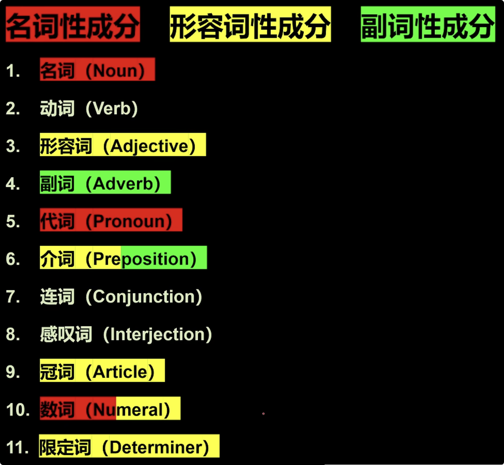

# English大纲攻略

## 句子成分 Clause Element

> 1、什么 +  怎么样  >>>  *主语(人/物) + 谓语(动作/发生了什么事)*
>
> 2、感叹句
>
> 3、省略句
>
> 4、（向整句提问）问句

> 定语：修饰，限定 名词性成分 ，可以理解为形容词属性
>
> 状语：修饰动词、形容词、其它副词成分，可以理解为副词属性
>
> 补语：补充说明额外补分，可以理解为名词属性 / 形容词属性

## 词性

> **介词：**表附加信息   介词+ …….
>
> **副词：**副词修饰动词、形容词、副词、整句
>
> **形容词：** 修饰名词，修饰限定
>         【限定词（主观特征)+尺寸+形状+新旧+颜色+来源+材料+用途】

## 动词

#### 五种基本句型

1. 主语 + 不及物动词（主谓）(SV)

   > 可以独立完成的动作

2. 主语 + 单及物动词 + 宾语（主谓宾）(SVO)

   > 有1个动作的承受者

3. 主语 + 双及物动词 + 间接宾语 + 直接宾语（主谓双宾）(SVOO)

   > 有2个动作的承受者

4. 主语 + 复杂及物动词 + 宾语 + （宾语）补语（主谓宾补）(SVOC)

   > 只有1个动作的承受者（但需补充）

5. 主语 + 系动词 + （主语）补语/表语（主系表）(SVP)

   > 非“动作”

#### 谓语动词

> 参考上文

#### 非谓语动词

> 几乎可以取代所有的从句，从而简化句子

#### 助动词

## 谓语

### 谓语动词

### 非谓语动词

## 造句

