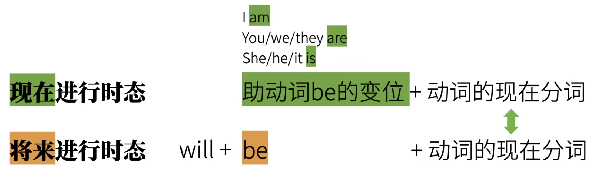
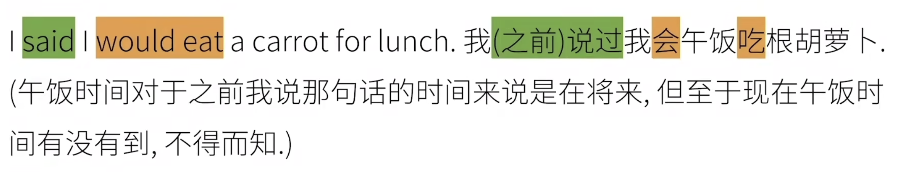
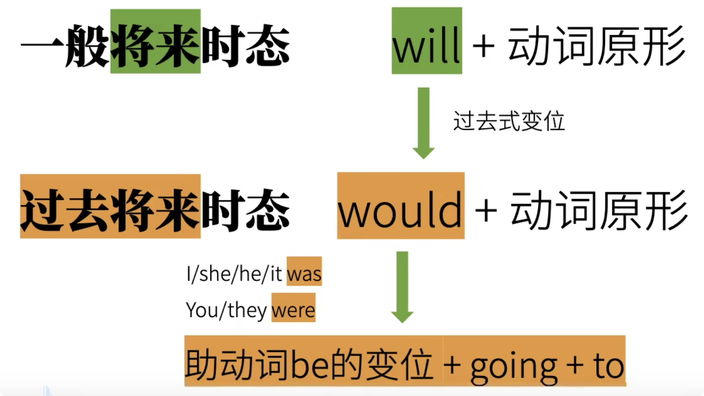
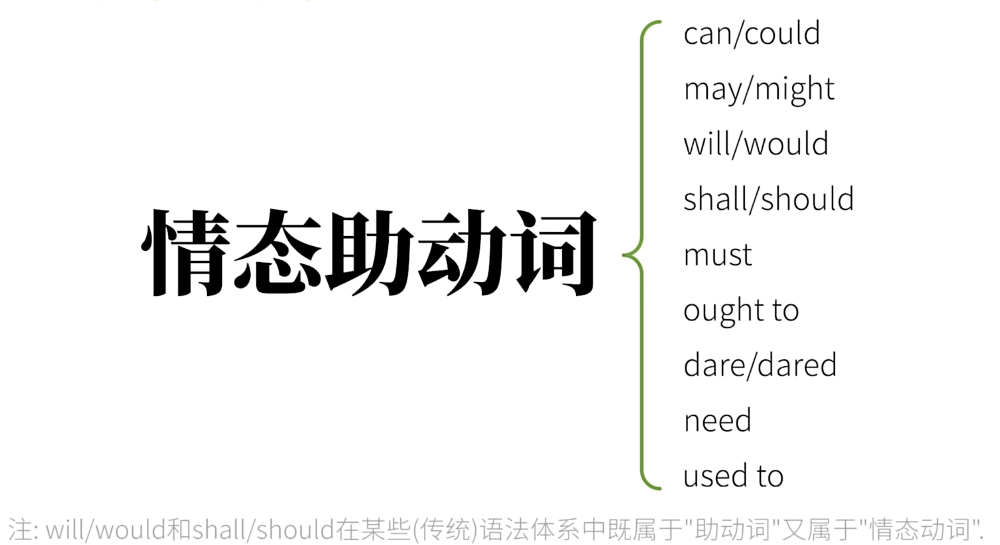

# 动词

## 动词分类

## 第一章 动词时态

### 1.1一般现在时态

> 1、表达事实
>
> 2、表达习惯/重复的动作
>
> 3、表达预计发送的事情

> I **eat** carrots.
> You **eat** carrots.
> We **eat** carrots.
> She **eats** carrots.
> The rabbit **eats** carrots.

### 1.2现在进行时态

> ### be
>
> 1. （连）系动词
> 2. 助动词，构成时态

### 1.3现在完成时态

https://www.sohu.com/a/169494425_790766

### 1.4现在完成进行时态

### 2.1一般过去时态

### 2.2过去进行时态

### 2.3过去完成时态

### 2.4过去完成进行时态

### 3.1一般将来时态

> 描述：将来某个时间点发生的事情（说话者**十分确认**会发生的事）
>
> 如果不太确定，就不能用一般将来时态

### 3.2将来进行时态

> 描述：在将来某个时间，某个动作是在 **进行的过程中**

### 3.3将来完成时态

### 3.4将来完成进行时态

### 4.1一般过去将来时态

### 4.2过去将来进行时态

### 4.3过去将来完成时态

### 4.4过去将来完成进行时态

## 第二章 动词语气

### 陈述语气

> 描述现实
>
> eg: The rabbit ate the carrot.

### 祈使语气

> 命令/请求
>
> 1. 用第二人称(你")用一般现在时态 You eat the carrot! -y Eat the carrot!
> 2. 去掉"你"并保证动词原形
>
> ##### **eg.**
>
> You eat the carrot!   =>  Eat the carrot!
> You don't eat it!       =>    Don't eat it!
> You are quiet!           => Be quiet!
> You never give up!   =>  Never give up!
> You give me conis!   => Give me conis!

### 虚拟语气

> **与现实相悖的想象，主观意愿！** 

shall 原型 =》 should 过去式

### 疑问语气

> 

### 条件语气

> 

### 感叹语气

> 

## 第三章 非谓语动词

> 谓语动词是受到主语限制的，且一个简单句中，只能有一个谓语动词，剩下的动词就是非谓语动词
>
> 非谓语动词 也可以叫 **非限定动词**  **non-finitive**

**非谓语动词可充当的句子成分：**

### a. 动词不定式

> 不定式：不受时间，人称等概念限制   **infinitive**
>
> to + 动词原型
>
> **eg.**  
>
> ​	To be or not to be, that is the question.  生存还是毁灭，这是一个问题.
> ​	You helped me (to) cook the carrot.  你帮我烧（做菜)了胡萝卜.
>
> 作介词词性： prefer A to B  或 prefer doing to doing   其中 to doing 作副词词性

#### 不定式作主语

#### 不定式作宾语

#### 不定式作宾语补语

> ==使役动词 后面用不定式做宾补需要省略 to==
>
> 

#### 不定式作主语补语（表语）

> The rabbit's dream is to eat every kind of carrot in the world.
> 兔子的梦想就是吃掉世界上每一种胡萝卜

#### 不定式作定语

> The rabbit has a lot of carrots to eat.
> 兔子有很多胡萝卜要吃.
>
> to eat 做后置定语

#### 不定式作状语

> 状语：表原因、目的、结果
>
> **表原因**  I was surprised to get a thumbs-up.  我很开心(因为)得到一个赞.
>
> **表目的**  I will do anything to get a thumbs-up.  我为了得到一个赞会做任何事.
>
> **表结果** I got enough thumbs-up to make another video. 我得到足够的赞，可以去做另一个视频啦！

#### 高级不定式

> 把不定式和状态结合
>
> to + 动词原形（"状态"）
>
> "to be eating a carrot"
> "to have eaten a carrot"
> "to have been eating a carrot”
>
> The rabbit seemed to be eating a carrot.
> 这兔子之前似乎在吃一根胡萝卜(的过程中）.
>
> The rabbit will appear to have eaten a carrot.
> 这兔子之后会看起来像是吃过了一根胡萝卜.

### b. 动名词

#### 1、作主语

Eating carrots is healthy for the rabbit.

#### 2、作表语

The rabbit's hobby is growing carrots.

Seeing is believing.

#### 3、作定语

**a sleeping pill   =  a pill for sleeping**

>  a sleeping pill   中的 sleeping  为 定语
>
> a  pill for sleeping 中的 sleeping  为 名词

#### 4、作宾语

The rabbit likes to eat carrots.  不定式作宾语
The rabbit likes eating carrots. 动词作宾语

> 动词不定式作宾语 =》 表示事情还未发生
>
> 动名词作宾语 =》 表示事情正在发生
>
> 
>
> forgot to do 忘记去做…
>
> forgot doing  忘记做过…

### c.现在分词

现在进行时 = be + 现在分词

#### **1、作定语**

a talking rabbit.一只说话的兔子  中  talking 词性=形容词  现在分词作定语

**现在分词 VS 动名词**

#### **2、作表语**

#### **3、作宾语补足语**

> 动词不定式作宾补时 => 表示一个动作自始至终的过程,强调动作已经发生了。
>
> 现在分词作宾补时 => 表示动作正在进行中,强调动作进行的状态。

#### **4、作状语.**

### d.过去分词

> 过去分词是非谓语动词，它不能自带时间，不能表示过去的时间

#### 作后置定语

#### 作表语

> 过去分词暗含 被动关系
>
> 现在分词暗含 主动关系

#### 作状语

## 第四章 助动词&情态动词

#### 助动词&情态动词

> 某些语法体系认为，助动词只起“辅助”作用，本事不该还有实意。所有把情态动词与助动词分成两类.
>
> 助动词两个特征：
>
> ​		1.辅助主动词；
> ​		2.不能像主动词那样单独作谓语动词.
>
> 情态动词特点：
>
> ​		1.起辅助主动词的作用.
> ​		2.不能单独作谓语动词．
>
> 
>
> 基于（
>
> ​		**1.是否辅助主动词来构成语法概念；**
>
> ​		**2.是否能单独作谓语动词.**
>
> ）两条来说，情态动词归为助动词的一类。
>
> 
>
> **说到底情态动词也是助动词的一种，不过情态动词可以有实际含义。**

基本助动词：be；do ；have  

#### 半助动词

> be able to
> be going to
> be about to
> had better
>
> ……..

#### 应用

## 第五章 系动词
