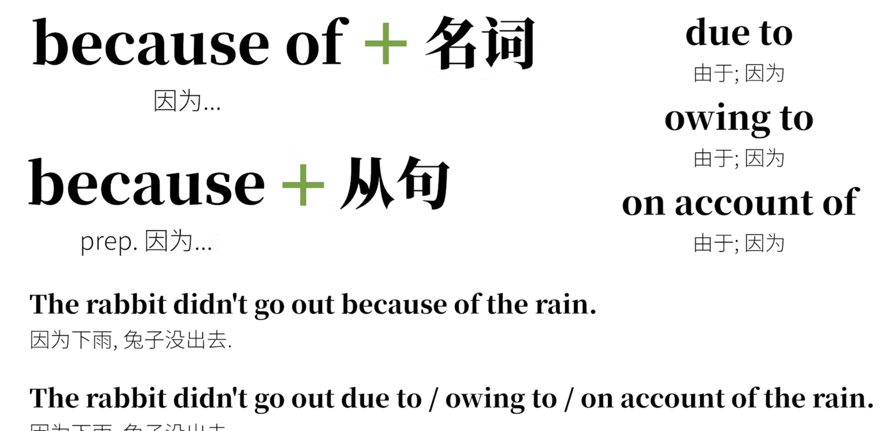

# 介词

## 介词的原理

> 凡虚字用以连实字相关之义者，曰‘介字’。
> 介字云者，犹为实字之介绍耳。
>                                                                      —–—马建忠
>
> 介词是虚词，就是为了介绍实词。 本质上是”前置词“
>
> 

## 介词的构成形式

### 简单介词

### 短语介词

> 即一个短语充当介词的功能。 不单独表完成意思。
>
> **短语介词** 和 介词短语  不同。

### 合成介词

### 分词介词

## 介词学习的误区

> 介词学习不应该同中文学习一样，去找一个固定的意思。
>
> 它类比与中文中的“多义词”.  Eg.  打人、打字、打住、打交道
>
> 

## 介词学习的诀窍

### 多含义难点

**about案例**

utan 是 outside 的意思，about 是在…的外面（之处）的意思。

所以下面是引申意

### 容易混淆

> in :  在…里  => 大范围移动
>
> on : 在…上  => 一个面，小范围移动
>
> at   : 在…某处  => 一个点上

I'm walking **in** (the area of) the street.
我在大街上走．
There is some trash **on** the street.
街上有些垃圾.
Right now I'm **at** Carrot Street and Apple Street.
现在我在胡萝卜街和苹果街的交界处．

in the morning 在早晨这个是时间范围

## 常见英语介词用法

#### 表空间时

in : 在…里面
on : 在…上面
at : 在某处
over : 覆盖；在…上方；越过上空
above : 在….上方(高于平面）
under : 在….下方  表在某物体正下方，可接触
below : 在….下方  表示低于某个平面，可以是正下方，也可以不是 
near :  在…附近；在..周边
by : 在 ... 旁边
beside : 在 ... 旁边；(非空间)比较
next to : 在….旁边；下一个；紧邻
across :  (从表面)横过
throught : (从内部)穿过
past : 经过;路过
in front of : 在…前方
before : 在…..之前
behind : 在….之后
between : 在…之间   between sth. and sth.  两者之间
amoung : 在…之间 表三者及三者以上之间  eg.The rabbit is standing among the carrots.
roud/around : 围绕；环绕
aloung : 沿着；顺着
to : 向；朝...
toward : 朝着….的方向
towards : 朝着…..的方向
onto : 到…上面
into : 到..里面（内部）
out of : 从里面出来
opposite : 在….对面
against : 与..相反；倚，靠  eg. We were rowing against the current.  我们逆水行舟.
up : 沿…向上
down : 沿….向下
off : 离….有一定距离

#### 表时间时

during ： 持续;在.期间
for ： 因为…因…持续；之前；由于 eg. I've been learning English for 2 years.我持续学习英语两年时间
since  : 自从
before :  在…之前
from...to...  从….到.  eg. from 9:00 to 10:00
by : 在.附近/旁边；不超过….边界;不迟于….前 eg.  by 2 o'clock .  by tomorrow.
until 直到…为止

#### 表方式时
in  : 方式;在...里面
through : 通过…方式;穿过
by : 通过…；在…旁边=> 引申出相关、依靠的意思
with ： 用…；和…一起
on ：在…上面  eg. We talked on the phone.  我们通过电话进行了交谈.   对比 online  线上

#### 表原因时
for ： 因为…由于…
with : 和..一起;….是和….分不开的原因 eg. The rabbit is shaking with cold.兔子冷得发抖.
about : 在.外面;关于
of : 此外的;附加的  eg. He **thought of** something important. 他**想起了**一些重要的事情．
on : 在….上面；关于 eg. Would you like some adviceon learning English?你想要些关于学习英语的建议吗？

#### 表数值时
at  : 在某处 eg. at a high price 在一个高的价格（点） at a fast rate 以一个很快的速率（点）
by :（后接度量标准） They get paid by the hour.他们按小时拿报酬.
for : 以….的价钱

#### 表状态时
in :在..里；在….状态中 eg. in progress 在进行(状态)中 ; in a dilemma处于进退两难的境地中
on  : 在…..之上；受到之下….的支持（的状态）**eg.** on a diet在节食（在节食支持的状态）on drugs吃药(在药物支持的状态）
at :在某处；在某个状态 eg. at work在工作  at dinner在吃晚饭
under : 在…下面；在(框架，前提)下 eg. under construction 在施工中 under discussion在讨论中

#### 表排除时
besides : 除了…还  eg. I like many things besides carrots. 除了胡萝卜，我还喜欢很多东西.
except : 除了…  表示从整体中排除出去  except for  eg.The party is greatexcept for the loud music.聚会很棒，除了嘈杂的音乐.

## 介词短语

> 介词短语 =  介词 + 其它词
> 
>
> **表达完整意思**
>
> 和**短语介词**（视为介词，不完整意）区别开来

介词短语通常做状语（描述动作的时间；地点；方式…）

## 介词固定搭配

for example 比如
at ease  自在
in turn 依次
in tears 哭了 ，因为痛哭流涕-眼沮流了一身所以被眼泪包寨，
need for 需要...
long for 渴望...
ready for 准备...

#### 短语动词

> 相当于一个全新的单词，需要额外记忆

