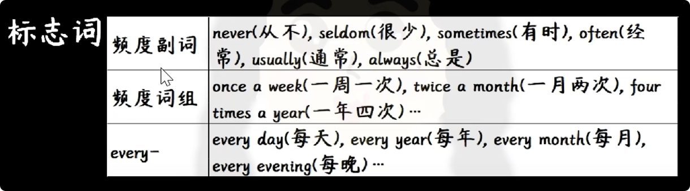
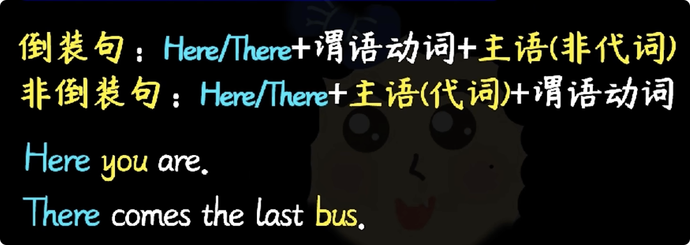
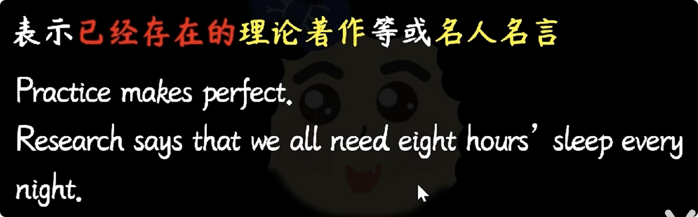
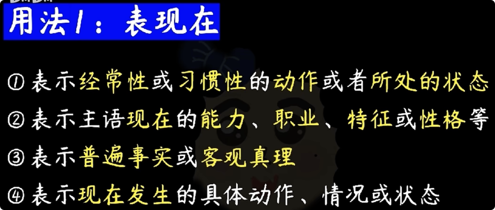
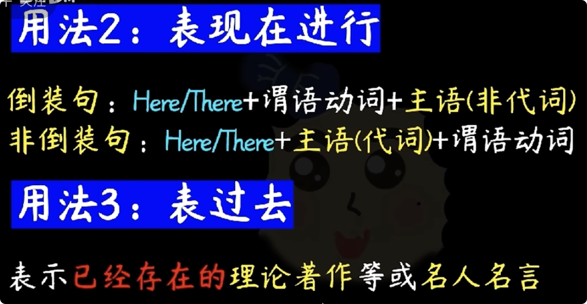
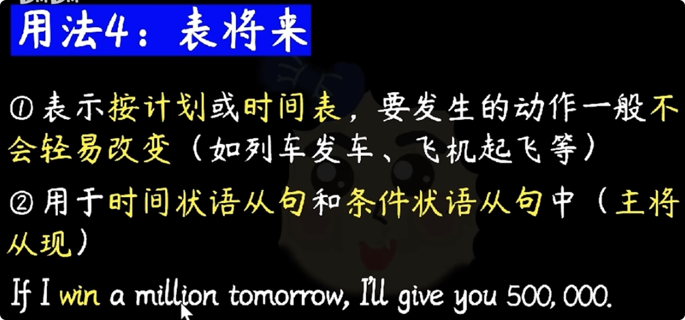

## 一般现在时

用法1：表现在

a.表<u>经常性</u>或<u>习惯性</u>的<u>动作</u>或者<u>所处的状态</u>

Yojion plays the guitar <u>ever day</u>.
She <u>often</u> stays up late.

b.表示主语<u>现在</u>的<u>能力、职业、特征或性格</u>等

Yajan is good at English.
Yajian has long hair.
Yajian is outgoing.

c.表示普遍事实或客观真理
The earth goes around the sur.
Springs follows winter.

d.表示现在发生的具体动作情况或状态
                            现在进行时：持续动作
I cant hear you wher you speak
I lved in Tokyo last year, but I live in Paris <u>now</u>.

用法2：表现在进行

记 Here you are.

用法3：表过去

用法4：表将来

a.表示<u>按计划</u>或<u>时间表</u>要发生的动作，一般不<u>会轻易改变</u>（如列车发车、飞机起飞等）
Our flight leaves at 9:00.
Schools begin on September 1st in China.

b.用于<u>时间状语从句和条件状语从句</u>中（主将从现）
If it <u>rains</u> tomorrow, I will not go shopping.
As soon as I <u>get</u> to Chengdu, I will call you

