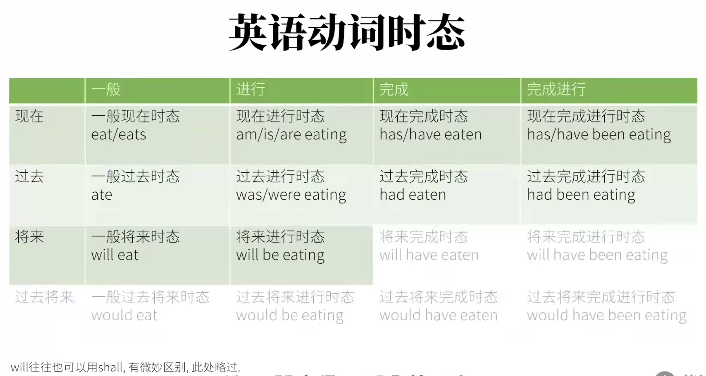

# 英语语法综述

## 背单词&成分&词性

1. 联想法
2. 词根词缀
3. 形近对照
4. 谐音

> 定语：修饰，限定 名词性成分 ，可以理解为形容词属性
>
> 状语：修饰动词、形容词、其它副词成分，可以理解为副词属性
>
> 补语：补充说明额外部分，可以理解为名词属性 / 形容词属性
>
> 同位语：一个名词(或其它形式)对另一个名词或代词进行解释或补充说明

> **介词：**表附加信息   介词+ …….
>
> **副词：**副词修饰动词、形容词、副词、整句、 ==修饰除名词以外的词。==
>
> **形容词：** 修饰名词，修饰限定
>      【限定词（主观特征)+尺寸+形状+新旧+颜色+来源+材料+用途】

## 时态

1. 现在进行时态表将来  => 只能用来表示不久的将来
1. 一般现在时表将来

## 被动语态

**谓语动词  =   be  +  done**

Be动词的形式<u>体现时态和单复数</u>

Done就是具体动作

**「+」不定式短语的别动语态**
       be going to / be due to  / be about to  / be to  将  == will
       ought  to   应当  == should
       be bound to  /  be sure to  / be certain to   一定会   == must
       hava  to  必须

例1： The  patient  ought to be operated on at once.     句子中   ought to be operated on   整个是谓语动词
例2： The  meeting is going to be held next week.

**「+」 祈使句的被动语态**

1. 肯定祈使句的被动语态：  let  + 宾语  + be  done.
2. 否定祈使句的被动语态： Do not let  +  宾语 + be done   =  Let  + 宾语 + not  +  be  done

例1：Let  us do it at once.
例2：Let it not be forgotten to water the flowers.  = Do not let the flowers be forgottern to be watered.

**「+」被动语态的使用要点**

1. 不及物动词没有被动语态
2. 表示状态的动词不能用于被动语态
3. 某些动词的进行时可以表示被动意义
4. 某些词的主动形式可以表示被动意义

## 否定和强调

1. 实义动词变否定：did/dose/do + not + 动词原型
2. 助动词/情态动词否定： 助动词/情态动词 + not
3. 否定的特殊形势：
   1. 补分否定：否定词 + 全部肯定   
   2. 否定转移：never(hardy/no) … but …           not … because(of) …          not … and…
   3. 形否意肯：  not … adj.  (比较级) …                  not … too …                      not … (过渡) …

4. 谓语动词的强调 ：  **谓语动词  =   助动词（do/does/did） +  动词原型**

- 谓语动词出现的8种形势：
  - **do（be，does）**
  - **did**，**be doing** ， **have done**
  - **be done**，**can do**，**do  do**，**not  do**

## 动名词

形式：doing

成分：作主语、宾语、表语

1. 时态和语态变化

   一般式：(主动) doning   (被动) being done

   完成式：(主动) having done   (被动) have been done

   进行时： 无

   完成进行时：无

## 名词性从句

分类：主语从句、宾语从句、表语从句、同位语从句

1. that + 陈述句
2. 特殊疑问词 + 从句
3. whether / if  + 从句
4. 宾语从句：介词 + 从句    (因为 介词 + 名词)

> that: 在同位语从句和定语从句中，不用进行区分，因为翻译方式一样
>
> ​	定语从句中的that 起 连接 + 做成分
>
> ​	同位语从句中的that 起 连接
>
> ​	只有1/4的名词用同位语
>
> 名词分类：可数【集体、个体】 不可数【抽象、物质】
>

### 主语从句

注意点：句子重心后置

### 宾语从句

1. 宾语从句必须用陈述语序 
2. 并从可以作及物动词，介词及形容词结构的宾语

形容词结构： I am sorry that 。。。

3. 先行词：where、whether、when、how、who、what、that

### 表语从句

1. 表从，位于主句中的系动词之后，除了that,whether和疑问词之外，as if , as though, beacuse 也可以

### 同位语从句

就是名词的翻译，翻译抽象名词（fact,hope,idea,news,doubt,suggestion,infomation,opinion,decision）

1. 考点：只考that 引导的同位语从句

## 代词

- 定义：代替名词成分的词

- 分类：
  1. 人称代词【作主语】((单)I/You/He/She/It   (复) We/You/ They)  
      	\【做宾语】((单)Me/You/Him/Her/it    （复）us/you/them)
  2. 物主代词【形容词(谁的….)】(my/our/your/yours/his/her/its/their)   
      	\【名词性(谁的东西)】(mine/ours/your/yours/his/hers/its/theirs)
  3. 反身代词：【第一人称】(myself  ourselves)  
            \【第二人称】(yourself  yourselves)  
            \【第三人称】(yourself  yourselves)  
            \【第三人称】(himself/herself/itself  themselves)  
  4. 相互代词：只有两个【  each other 相互(两个)       one another 三个以上  】
  5. 指示代词：表示指示概念的代词
            包括：**this/that** (这个/那个) ;   **these/those** (这些/哪些)  ;   **such/same/so**(如此/相同/也)
  6. 疑问代词：在句中起名词词组的作用，用来构成疑问句。（连接代词、关系代词）
            包括：who、whom、whose、which、what
  7. 不定代词：不指明代替任何**特定名词**或**形容词**的代词
            包括：some（someone、something、somebody）
                          any（anyone、anything、anybody）
                          every（everything、everyone、everybody）
                          no（onthing、nobody、no  one）
                         all、each、both、much、many、(a)little、(a)few、other(s)、another、none、one、either、neither

名词+that (1.同位语从句  2.限制性定语从句)

## 形容词

**定义：** 用来描述名词的性状特定的词，多出现在名词之前，用作定语。

**[+]**   形容词短语 修饰名词， 形容词短语后置

**[+]**    修饰不定代词时，形容词后置

【限定词（主观特征)+尺寸+形状+新旧+颜色+来源+材料+用途】

## 定语从句

**定义：** 在句子中，充当定语(形容词属性)，修饰名词，并位于名词之后的从句叫做定语从句。

**构成：** 先行词 + 关系词 + 从句

**「+」**  关系词**【连词性代词】**的功能： 1. 连接主从句   2.指代先行词

**「+」**  关系词分类 ：

​		**关系代词：**   【主要包含】(**that**/whose/who/whom/which/as)  
​				      【对应先行词】(人、物、(**as**)？)   
​				      【在从句中充当的成分】（主语、宾语）

​		**关系副词:**  【主要包含】（when/where/why/whereby(方式)）
​				   【对应先行词】(时间、地点、原因、方式)  
​				   【在从句中充当的成分】（状语）

> 1. when：关系副词when在从句中作时间状语，先行词是表示时间的名词time、moment、day、month、season、year、period等
> 2. where：where在从句中作地点状语，先行词是表示地点的名词place、house、city、country、world等
>           当先行词是表示抽象地点的名词(point, situation, stage, condition, case, position等)时，也常用where引导定语从句
> 3. why：why在从句中作原因状语，先行词是reason
>           - 当先行词是reason，但从句缺少主语或宾语时，则要用that/which来引导定语从句
> 4. 关系副词when、where、why常常和“介词+ which”结构交替使用

**「+」** “介词 + 关系代词” 引导定从 ：

​		**关系代词：**  只能用（which |  whom）

​		**介词的选择：** 
​				1.与定从中的动词搭配.  This is the iPad **on which** I spent 3000 $.
​				2.与先行词搭配.  The reason **for which** I am here is that I have to.
​				3.根据语义需要而确定.   Water is essential to life **without which** we cannot alive.

**例1：** Most  journalists(记者) learn to see the world throught a set of standard templates(模式) **into which** they plug(插入) each day’s events.

**解析：**句子中  into which 引导定语从句  
         **into which** they plug  each day’s events.  == which they plug  each day’s events into.

**分类：**  

| 区别\类别 | 限制性定语从句                                               | 非限制性定语从句                                             |
| --------- | ------------------------------------------------------------ | ------------------------------------------------------------ |
| 形式      | 无逗号                                                       | 有逗号，将主句和从句分开                                     |
| 先行词    | 先行词的<u>**范围不明确**</u>                                | 先行词的<u>**范围明确**</u>                                  |
| 作用      | 修饰限定先行词，不能省略，影响表意                           | 补充说明先行词，可以省略不印象表意 <u>相当于 and引导的并列句，其补充说明</u> |
| 关系词    | 1.关系词可以用that  2.作宾语可以省略  3.指人作宾语，可以使用whom/who/that | 1.关系词不能用that 2.关系词不可省略 3.指人作宾语，只能用whom |

  名词+that 

| 区别 | 同位语从句 | 限制性定语从句 |
| ---- | ---------- | -------------- |
| 形式 | n. + 从句 | n. + 从句 |
| 作用   | 解释说明前面的名词   | 修饰限定先行词                             |
| 位置   | **抽象名词后**       | 任意名词后                                 |
| 结构   | that后的句子成分完整 | that后的句子成分不完整，that在其中充当成分 |
| 关系词 | 关系词不能省略 | 关系词在从句中作宾语时可以省略 |

### 特殊的关系词-as

> as在从句作宾语或者主语

1. As 引导限定性定语从句，such ... as …  或  the same … as …  两种组合使用
2. As引导非限定性定语从句，用法与which相似，但位置比较灵活

例1. He is not such a fool **as** we would assume him to be.

例2. **As** is so often pointed out, konwledge is a two-edged weapon which can be used equally for good or evil.

### 总结

1、与先行词的关系：限制性定语从句与主句关系紧密，它和主句之间不能用逗号隔开，而且一般不能省去；非限制性定语从句是对先行词的附加说明，它和主句之间往往用逗号隔开，而且可以省去，对整个句子结构无影响

2.先行词不同：限制性定语从句的先行词往往是某一个词，但非限制性定语从句的先行词可以是一个词，也可以是句子的一部分，甚至是整个主句，此时非限制性定语从句一般由which或as引导，as引导非限制性定语从句常用在as is said / known / expected / mentioned / reported / announced等结构中

3、关系词的使用不同：that 不可引导非限制性定语从句。关系代词 whom 在限制性定语从句中作宾语时可用 who 代替 whom, 但 whom 在非限制性定语从句中作宾语时不可用 who代替。关系代词在限制性定语从句中作宾语时可以省略；非限制性定语从句的所有关系代词均不可省略

4、形容词短语可以做后置定语

​	https://www.en998.com/g/dingyu/020210307.html

## 副词

> 定义：==【adv.】==副词可以用来修饰、限定动词，也可以用来修饰形容词、其它副词以及全句。 ==   ==修饰除名词以外的词。==
>
> ​	用来说明动作发生的时间、地点、原因、条件、程度以及方式等。
>
> ​	在句子中作状语、定语、表语、宾语补语。位置非常灵活，可在句首、句中、句末。
>

**「+」副词形式：**

1. 同拼写，同义 | 近义
2. 同拼写，异义
3. 副词 = 形式词 + ly , 同义 | 近义
4. 副词 = 形式词 + ly , 异义

**「+」副词种类：**

1. 方式副词

   slowly. fast（迅速地）、carefully（小心地）、carelessly（粗心地）effortlessly（不费力地）、urgently（急切地） properly(适当地)，anxiously(焦虑地)，politely，proudly …

2. 地点副词
   here， there， everywhere， anywhere，somewhere， in， out， inside， outside …

3. 程度副词
   much，little， very，rather(相当)，so，too，still， quite， perfectly(完美地) …

4. 时间副词
   now，then，often，always，…

5. 频率副词
   Always, often, ever, never, …

6. 疑问副词
   how， when， where， why …

7. 连接副词
   then，when ，where，how，why…

8. 关系副词
   when， where， why …

9. 句子副词

[参考连接](https://baike.baidu.com/item/%E5%89%AF%E8%AF%8D/974#:~:text=%E5%89%AF%E8%AF%8D%EF%BC%88Adverb%20%E7%AE%80%E7%A7%B0adv.%EF%BC%89,%E4%BB%A5%E5%8F%8A%E8%A1%A8%E5%AE%8C%E6%88%90%E7%9A%84%E5%89%AF%E8%AF%8D%E3%80%82&text=adv.,-%E8%BF%90%E7%94%A8%E6%96%B9%E5%BC%8F)

[参考连接](https://zhuanlan.zhihu.com/p/44758305)

## 状语从句

> 定义：  起副词作用，作状语的从句
>
> 构成：  主句  +  <u>连词</u>  +  <u>完整的句子</u>
>
> <u>从属连词</u> 在句子中不做成分，由主句和从句的逻辑关系决定，逻辑关系只能通过语义判断。
>
> 状语：修饰动词、形容词、其它副词成分，可以理解为副词属性。

**「+」 1.时间状语从句：** 说明主句和从句发生时间上的先后关系

​	常用连接词：while   as    when   before   after   till（直到）   until   since(自从)
​			一 …. 就 … 【as soon as ,  no sooner … than … ,   hardly/scarcely  … when …】
​			一 …. 就 … 【the minute/second/moment/day  ， every time 】

1. not … untill  …  直到 … 才 …    ，单独使用时   until = before

**「+」 2.地点状语从句：**  说明主句动作发生的场所

​	常用连接词：where   wherever   everywhere   anywhere

**「+」 3.原因状语从句：** 说明主句动作发生的原因，与主句之间存在因果关系。  主句（结果）从句（原因）

​	常用连接词：【because   since   as   for】 表“因为”
​			【now that     seeing(that)     considering(that)(考虑到)     given(that)】都可以表“因为”

**「+」 4.结果状语从句：** 说明主句的动作导致的结果，和主句之间存在因果关系。 主句（原因） 从句（结果）

​	常用连接词：so that (因此\所以)      so ..(adj.).. that …(如此..以至于..)       such ..(n.)..  that … 

**「+」 5.目的状语从句：** 说明主句的动作发生的目的，和主句之间存在 <u>隐性的因果关系</u>

​	常用连接词：so that(为了)       in order that(为了)

​	<u>目的状语从句中常含有情态动词</u>  <u>may/might  ,  shall/should  ,  will/would  ,  can/could</u>

​	例1：When I was a child, I would take a flashlight to bed with me **so that** I <u>could</u> read books without my parents’ knowing about it.

​	

**「+」 6.条件状语从句：** 说明主句的动作发生的条件，和主句之间存在 <u>隐性的因果关系</u> 。  【从句中的条件(表示没有发生的原因)】

​	常用连接词：if       unless(除非)          only if(只有如果)   

​	例1：I will **not** lend the book to you **unless** you can return it in time.
​	例2：**Only if** you study hard **will you pass** the final-examination.
​			-》  will you pass 倒装 ，因为 Only if引导状语要部分倒装

​     【+】 <u>**If Only**  + 与事实相反</u>  要是…就好了…   <u>后面跟虚拟语气</u>
​	例3：If only we had arrived at the station in time, we could have met him.

**「+」 7.让步状语从句：** 一般范围为”尽管…“或”即使…“等，和主句的语义通常构成转折关系

​	常用连接词： 【though  /  although  /  while  /  as】（虽然）
​			        【even though   /   even if】（虽然）
​				no matter + 疑问词  =  疑问词-ever  （不管怎样/是否/什么等）
​				whether  …  or … （不管 ..A.. 还是 ..B..）

1. <u>as 引导让步状语从句，必须后置词前置</u>
 例1：Hard <u>as</u> he tried, he failed.
2. although/while 引导让步状语从句，不能倒装
 例2：<u>While/Although</u> he tried hard, he failed.
3. though 引导让步状语从句，可以倒装，也可以不倒装
 例3：Hard <u>though</u> he tried, he failed.

4. no matter how = however   /    no matter who = whoever

例4：But whether it’s a friendly rivalry or a fight to the death, the end result is the same.
	不管是友好竞赛还是你死我活的斗争，结果都一样.

**「+」 8.比较状语从句：** 表示比较、比例、类比的从句

​	常用连接词：as （一样）    /    than     （比起）

1. 同级比较  - as 
   例1：This building is <u>as</u> high <u>as</u> that one.          例2：It is not <u>so</u> difficult <u>as</u> you think.
2. 优级比较  -  than
   例1：The  room is bigger than that one.        例2： I work less hard than Tom(does).

**「+」 9.方式状语从句：** 表示主句动作发生的方式

​	常用连接词： as / like / the way    （以…的方式）
​				as if    /   as though  （就好像）
​				the way

例1：When in Rome, do as the Romans do.   解析：as引导方式状语从句，do as the Romans do 为祈使句.

**「+」 总结** 

1. as   当 ；虽然 ；因为 ；一样 ；以…的方式

2. while 当 ；虽然

3. since  自从；因为

### 状语从句的省略

1. 主句和从句的主语一致，或从句主语为it；  
2. 从句主要动词是be的某种形式。从句中的主语和be动词常可省略

### 插入现象

> 通常位于主语谓语之间，前后逗号或者破折号隔开
>
> 构成的语法成分有：
>
> ​	状语及状语从句
>
> ​	同位语
>
> ​	非限制性定语从句
>
> ​	宾语从句

## 介词

> 介词【 prep. 】：表示名词、代词等与句中其它词的关系，在句子中不能独立作成分。
>
> 介词后面一般跟  <u>**名词性成分、代词、短语或从句中作它的宾语**</u>
>
> 
>
> 【**介词短语**】：可做表语、定语、状语、补语
>
> 
>
> **格式：介词 + 名词**

#### 表时间时

during ： 持续;在.期间
for ： 因为…因…持续；之前；由于 eg. I've been learning English for 2 years.我持续学习英语两年时间
since  : 自从
before :  在…之前
from...to...  从….到.  eg. from 9:00 to 10:00
by : 在.附近/旁边；不超过….边界;不迟于….前 eg.  by 2 o'clock .  by tomorrow.
until 直到…为止

#### 表空间时

in : 在…里面
on : 在…上面
at : 在某处
over : 覆盖；在…上方；越过上空
above : 在….上方(高于平面）
under : 在….下方  表在某物体正下方，可接触
below : 在….下方  表示低于某个平面，可以是正下方，也可以不是 
near :  在…附近；在..周边
by : 在 ... 旁边
beside : 在 ... 旁边；(非空间)比较
next to : 在….旁边；下一个；紧邻
across :  (从表面)横过
throught : (从内部)穿过
past : 经过;路过
in front of : 在…前方
before : 在…..之前
behind : 在….之后
between : 在…之间   between sth. and sth.  两者之间
amoung : 在…之间 表三者及三者以上之间  eg.The rabbit is standing among the carrots.
roud/around : 围绕；环绕
aloung : 沿着；顺着
to : 向；朝...
toward : 朝着….的方向
towards : 朝着…..的方向
onto : 到…上面
into : 到..里面（内部）
out of : 从里面出来
opposite : 在….对面
against : 与..相反；倚，靠  eg. We were rowing against the current.  我们逆水行舟.
up : 沿…向上
down : 沿….向下
off : 离….有一定距离

#### 表方式时

in  : 方式;在...里面
through : 通过…方式;穿过
by : 通过…；在…旁边=> 引申出相关、依靠的意思
with ： 用…；和…一起
on ：在…上面  eg. We talked on the phone.  我们通过电话进行了交谈.   对比 online  线上

#### 表原因时

for ： 因为…由于…
with : 和..一起;….是和….分不开的原因 eg. The rabbit is shaking with cold.兔子冷得发抖.
about : 在.外面;关于
of : 此外的;附加的  eg. He **thought of** something important. 他**想起了**一些重要的事情．
on : 在….上面；关于 eg. Would you like some adviceon learning English?你想要些关于学习英语的建议吗？

#### 表数值时

at  : 在某处 eg. at a high price 在一个高的价格（点） at a fast rate 以一个很快的速率（点）
by :（后接度量标准） They get paid by the hour.他们按小时拿报酬.
for : 以….的价钱

#### 表状态时

in :在..里；在….状态中 eg. in progress 在进行(状态)中 ; in a dilemma处于进退两难的境地中
on  : 在…..之上；受到之下….的支持（的状态）**eg.** on a diet在节食（在节食支持的状态）on drugs吃药(在药物支持的状态）
at :在某处；在某个状态 eg. at work在工作  at dinner在吃晚饭
under : 在…下面；在(框架，前提)下 eg. under construction 在施工中 under discussion在讨论中

#### 表排除时

besides : 除了…还  eg. I like many things besides carrots. 除了胡萝卜，我还喜欢很多东西.
except : 除了…  表示从整体中排除出去  except for  eg.The party is greatexcept for the loud music.聚会很棒，除了嘈杂的音乐.

## 非谓语动词

> 除谓语以外的各种句子成分中的动词形式，叫非谓语动词。
>
> 非谓语动词也是动词的一种，可以充当主语、宾语、状语等

**「+」 形式：** 

| 形式           | 功能                                                         |
| -------------- | ------------------------------------------------------------ |
| 不定式 to do   | 可作名词、形容词、副词。 因此不定式可以充当除谓语之外的任何其它成分 |
| 现在分词 doing | 相当于形容词、副词。 在句子中充当定语、状语、补语       |
| 过去分词 done  | 相当于形容词、副词。 在句子中充当定语、状语、补语       |
| 动名词         | 相当于名词 在句子中充当主语、表语、定语、宾语           |

**「+」 性质：** 保留动词的基本特征

1. 有<u>动作发出者</u>，我们称之为<u>逻辑主语</u>。
2. 非谓语动词作**<u>定语</u>**时，其逻辑主语为所修饰的名词；
3. 非谓语动词作**<u>状语</u>**时，其逻辑主语一般为句子主语；
4. 当动词与逻辑主语之间是**<u>主动关系</u>**时，则使用doing形式；
5. 当动词与逻辑主语之间是**<u>被动关系</u>**时，则使用done形式；
6. 可以加宾语和其它成分

**「+」 不定式** 

1. 作主语
   例1：To err is human；to forgive(原谅), divine(神).   人人都会犯错，神才会原谅。   其中“；”等同于 and.
2. 作宾语
   例2：This company refused to cooperate(合作) with us.   这家公司拒绝和我们合作
   例3：I don't know whether to answer his letter.   特殊疑问词+to do  ，整体合起来作宾语
3. 作定语：常后置于名词之后
   例4：She was the only one to survive the crash.
4. 作状语：修饰句子，位置灵活，通常用逗号和主句隔开
   例5：To avoid criticism, do nothing, say nothing, be nothing.   祈使句。啥也别干，啥也别说，当不存在，为了避免被批评。
5. 作表语
   例6：The duties(任务) of a postman(邮递员) are to deliver(分发) letters and newspapers.

**「+」 现在分词** 

1. 作定语：后置于修饰的名词之后
   例1：This book, dealing with English composition(写作，组成), was written by a professor.
2. 作状语：修饰句子，位置灵活，通常用逗号和主句隔开
   例2：<u>Studying hard</u>, you must pass the exam.
   例3：<u>Hearing the knock on the door</u>, they stopped talking.
   分析： you 和 Studying ，they 和 Hearing  之间是主动，所有使用 doing形式

**「+」 过去分词** 

1. 作定语
   例1：This book, <u>written in simple English</u>, is suitable fo beginners.
   例2：The funds(资金) <u>raised(筹集)</u> are mainly used for <u>helping the homeless(作for的宾语)</u>. 
   总结： written 和 book ,  raised 和 fund  之间是被动，所以用done形式
2. 作状语
   例1：<u>Confined(限制) to bed</u>, she needed to be waited on in everything.
   例2：Almost all English prepositions(介词) <u>when turned into Chinese</u> look like verbs.  **其中用到了状语从句的省略**

### 分词作状语的特殊形式 — 独立主格结构

> 分词作状语时，其逻辑主语与句子主语不一致时，这时使用独立主格结构。 
>
> 分词作状语就是独立主格结构

**「+」 基本形式：** 

1. 名词 + 分词
   例1：<u>Time permitting</u> , we are going to Beijing Botanical(植物) Garden.

2. 介词 + 名词(逻辑主语) + 分词   => 一般是 with + 名词 + 分词
   例2： A car roared(呼啸) past, <u>with(带着) somke pouring</u> from the exhaust(排气管).

3. 副词 + 分词
   例3：Generally speaking, he is an honest person.

### 总结

1. 不定式
   (1)基本形式：to do（表示主动，并且一般表示将来）
   (2)被动式：to be done（表示被动，并且一般表示将来）
   (3)进行式：to be doing （表示主动和进行）
   (4)完成时：to have done（表示主动和完成）
   (5)完成被动式：to have been done（表示被动和完成）
   (6)完成进行式：to have been doing （表示主动和完成进行）

2. 动名词
   (1)基本形式：doing （表示主动）
   (2)被动式：being done（表示被动）
   (3)完成式：having done（表示主动和完成）
   (4)完成被动式：having been done（表示被动和完成）

3. 现在分词
   (1)基本形式：doing （表示主动和进行）
   (2)被动式：being done（表示被动和进行）
   (3)完成式：having done（表示主动和完成）
   (4)完成被动式：having been done（表示被动和完成） 

4. 过去分词：done及物动词的过去分词表示被动或完成；不及物动词的过去分词表示主动或完成

 【+】非谓语动词本身不能表示现在和过去，非谓语动词表示进行、将来和完成时是相对于谓语动作来说的：和谓语动作同时发生表示进行；发生在谓语动作之后表示将来；发生在谓语动作之前表示完成的哦

## 虚拟语气

> 定义：指所说的话只是一种与事实相反的主观愿望、假象或者建议等。
>
> 虚拟语气可用于条件状语从句、主语从句、表语从句、同位语从句以及其它结构中。
>
> 虚拟语气主要有句子的谓语动词表现出来。
>
> 
>
> **【时态后置原则】** 从句时态相对于主语的时态向后推一个   过去  <- 现在 <- 将来

**「+」 If条件状语从句的虚拟语气** 

1. 与现在事实相反
   谓语动词 ： if从句（过去式  did/**were**） 主句（would/should/might/could + do）
   		<u>**be动词统一都变成 were**</u>
   例1：I <u>have found</u> it worth living, and(I) <u>would gladly live</u> it again if the chance <u>were offered</u> me.
2. 与过去事实相反
   谓语动词 ： if从句（had + done） 主句（would/should/might/could + have + do）
   例1：I <u>wouldn't have known</u> what these were for if I <u>hadn't been</u> told.
   例2：If the art dealer <u>had had</u> the money, he <u>would have bought</u> the painting.
3. 与将来事实相反
   谓语动词 ： if从句（should + do 或 were + to do） 主句（would/should/might/could + do）
   例1：If i <u>were to live</u> my life over again, I <u>would have</u> you as my wife.

**「+」 【==考点==】：虚拟条件状语从句的倒装** 

​	由if引导的虚拟条件状语从句，可以省略if，从句使用部分倒装（即将从句的助动词were、should或had提至主语之前）

​	例1：<u>Should I win</u> the lottery(大乐透), I would buy a car.
​	例2：Countless(不计其数) divorced(离婚的) politicians() <u>would have been elected(选举) out of</u> office years ago <u>had they even thought</u> of a divorce, <u>let alone(更别说)</u> gotten one.  
​		如果这些政客以前想要离婚，那么他们会被剔除办公室，更别说已经离婚的

**「+」 名词性从句的虚拟** 

​	要点：表示要求、建议、命令等动词所引导的宾语从句要使用虚拟语气，<u>**从句的谓语动词为“should do”**</u>,其中should可以省略.

​	分类：宾语从句虚拟、表语从句虚拟、同位语从句虚拟、形式主语句型虚拟

​	坚持: insist
​	命令: order，command
​	建议: suggest,  advise,  recommend,  propose
​	要求: ask,  require,  demand,  request,  urge,  move

​	**「-」 形式主语句型的虚拟** 

​		要点:“It is+形容词/过去分词/特定的名词+that”的主语从句有些要使用虚拟语气，其谓语动词形式为，其中should可以省略。should do”

​	例1：It is strange（surprising\disappointing） that she (should) not have been invited.

**「+」 Wish后面宾语从句的虚拟** 

​	要点:用来表示说话者难以实现的或与事实违背的愿望，具有较强的感情色彩，
​		可分别表示对现在(were/ did)、过去(had done)和将来(情态动词+ do)情景的虚拟。

​	例1：I wish I <u>were</u> a little younger.
​	例2：I wish I <u>had not attended</u> that party.
​	例3：I wish he <u>could expain</u> what he means.

**「+」 在If  only 感叹句中的虚拟** 

​	要点: if only 表示“但愿”“要是 … 就好了”，其用法和wish基本一样，只是比wish具有更强烈的感情色彩。  
​		    only if “只有如果”

**「+」 as if / as though引导的从句中的虚拟** 

​	要点:       1.as if / as though 引导的方式状语从句 ，  意思：“好像 … 一样”
​			2.动词seem/look/smell + as if /as though 引导的表语从句

​	从句使用虚拟语气，表示对现在(were/ did)、过去(had done)和将来(情态动词+ do)情景的虚拟

**「+」（特殊） It is (high) time that 句型的虚拟  ** 

​	要点:  It is (high) time that 从句中谓语动词常使用过去式（did/were）, 有时也用should do ,含建议的意思。
​		意思： ”到了做…的时候“

**「+」 （特殊）would rather / would (just) as soon/would sooner / would prefer等宾语从句中的虚拟** 

​	要点： 这些词组表“宁愿”，后面跟的宾语从句要使用虚拟语气，表示对<u>**现在和将来(were/ did)**</u>、过去(had done)情景的假设.
​		<u>注意没有将来(情态动词+ do)了.</u>

​	例1： I’d rather we didn’t go to see a film this evening.
​	例2：I’d just as soon you had returned the book yesterday.

## 特殊句型

### 倒装句型

​	**定义：** 倒装是一种语法形式，用以**保持句子平衡、强调或表达固定**的句型结构。
​			句型：谓语 + 主语   
​			分类：全部倒装   、  部分倒装

**「+」部分倒装：** 指谓语中的一部分（如助动词、情态动词）倒装至主语之前  
			形式：情/助(v1)  + S.  + 实义动词(V2)

1. 否定状语   位于句首
   	     例1：<u>Never have</u> I seen so many people.
2. only + 状语  位于句首
   	     例2：<u>Only then</u> <u>did I</u> realize that I was wrong.
            	     例3：Only in this way can you learn English well.
3. so … that 引导结构状语从句，“so + 形容词”位于句首
   	     例4：<u>So fast</u> <u>does light</u> travel that it is difficult for us to imagine its speed.

**「+」全部倒装：** 将句子的谓语动词部分全部至于主语之前，即“v + 主语”
					此结构一般用于一般现在时和一般过去时

1. There be 句型
   例1：<u>There is a table（= a table is there）</u> in the room.
   例2：<u>There stands a temple(庙宇)(= a temple stands there)</u> on the top of the mountain.
2. 主系表结构中，表语提前
   例1：<u>Gone are the days</u> when marriage was women's only opinion(意见).

### 比较句型

**「+」结构：**   more … than  /  less … than  / as … as / not so … as
			 no(=not …any) more … than    与其说…不如说 
			 no(=not …any) less … than  

例1：Science, in practice, depends far less <u>on the experiments</u> than <u>on the preparedness</u> of the minds of the men who watch the experiments.

### 强调句型

**「+」结构：** It is + 被强调部分 + that / who/which + 句子其他部分
		被强调的通常是主语、宾语、状语，不可强调谓语

例1：It was <u>Edison</u> <u>who</u> watched the movie with me last Sunday.

例2：It was <u>your boyfriend</u> <u>that</u> I met on the basketball court yesterday.

例3：It was <u>under the blackboard（状语）</u> that I found the money.

**「+」==要点==**  **强调句和从句的区别：** 

​		辨别方法：去掉It is/was … that 结构后，剩余的仍然是一个句子成分完整的句子，则是强调句。
​				如果剩余的不是一个句子成分完整的句子，则是 主语从句、定语从句 或 状语从句

​	例1. It is reading literature that **is** extremely significant to theteenagers.  强调句
​	例2.It **was** predicted **that** the temperature of next monthwould rise continuously. 形式主语句型
​	例3.It is **such** an interesting book **that** we all like it verymuch.  状语从句

tichang

### 省略句型

**「+」并列结构的省略：** 

例1. Jack <u>picked</u> up a coin on the road **and** <u>handed</u> it to a policeman.
例2. His advice made me happy, **but** （His advice made）Jim angry

例3. **As** families **move** away from their stablecommunity, their friends for many years, their extendedfamily relationships, the informal flow of information **is** cut off, **and** <u>the confidence</u> that information **will be** available when **needed** and **will be** trustworthy and reliable. 

**「+」状语从句的省略：** 

​	要点： 状语从句的主语和主句主语一直，从句的谓语动词含有be动词时，可以省略状语从句的主语和be动词.

​	例1： Once (~~he was~~) a worker, William now becomes a famous singer.

## 固定搭配

https://www.zhihu.com/question/40342212

**1. “动词 + 介词”搭配**，比如“look at”：

> The kid is looking.
> The kid is looking **at a little rabbit***.*

介词短语“at a little rabbit”作状语修饰动词look，两者组成了我们常见的搭配“**look a**t”。

可见，“动词 + 介词”搭配是由“**介词短语作状语修饰动词**”所形成的。

类似“go to”、“translate...into...”的搭配也是由同样的原理构成的：

> They will go **to school**.
> They can translate English **into 25 languages**.

**2. “形容词 + 介词”搭配**，比如“[different from](https://www.zhihu.com/search?q=different from&search_source=Entity&hybrid_search_source=Entity&hybrid_search_extra={"sourceType"%3A"answer"%2C"sourceId"%3A214288388})”：

> Chinese is different.
> Chinese is different **from any other languages**.

不难得到，“形容词 + 介词”搭配是由“**介词短语作状语修饰形容词**”所形成的。

类似“skeptical of”、“anxious about”等搭配也是这么构成的：

> Experts are skeptical **of Tom’s findings**.
> Tom was anxious **about his exam results**.

**3. “[介词短语](https://www.zhihu.com/search?q=介词短语&search_source=Entity&hybrid_search_source=Entity&hybrid_search_extra={"sourceType"%3A"answer"%2C"sourceId"%3A214288388})作定语”所构成的搭配**，比如“take the place of”

> He will take the place.
> He will take the place **of Mr White**.

介词短语“of Mr White”作定语修饰名词the place，形成了搭配“take the place of”。

类似的例子：“have/get access to”、“make the best of”等

**4.“动词 + 副词”构成的搭配**：比如“stand up”：

> He stands **up** to grab the ping-pong ball.

副词up修饰动词stand，构成搭配“stand up”。

类似的例子：“[fly over](https://www.zhihu.com/search?q=fly over&search_source=Entity&hybrid_search_source=Entity&hybrid_search_extra={"sourceType"%3A"answer"%2C"sourceId"%3A214288388})”、“break down”、“[look](https://www.zhihu.com/search?q=look&search_source=Entity&hybrid_search_source=Entity&hybrid_search_extra={"sourceType"%3A"answer"%2C"sourceId"%3A214288388}) in”等等

**5. “动词 + 宾语 + [补语](https://www.zhihu.com/search?q=补语&search_source=Entity&hybrid_search_source=Entity&hybrid_search_extra={"sourceType"%3A"answer"%2C"sourceId"%3A214288388})”构成的搭配**，比如“turn...off”：

> Can you turn the light **off**？

形容词off是the light的补语。

类似“lift...up”、“keep...out”等搭配也是这样构成的：

> The guy lifted wooden boxes **up**.
> You may keep him **out.**

**6. "[主系表](https://www.zhihu.com/search?q=主系表&search_source=Entity&hybrid_search_source=Entity&hybrid_search_extra={"sourceType"%3A"answer"%2C"sourceId"%3A214288388})"句型构成的搭配**，比如“get up”：

> I get up early.

get是[系动词](https://www.zhihu.com/search?q=系动词&search_source=Entity&hybrid_search_source=Entity&hybrid_search_extra={"sourceType"%3A"answer"%2C"sourceId"%3A214288388})，up是形容词（词义是“起床的”），两者组成了搭配“get up”。

类似“[come true](https://www.zhihu.com/search?q=come true&search_source=Entity&hybrid_search_source=Entity&hybrid_search_extra={"sourceType"%3A"answer"%2C"sourceId"%3A214288388})”、“go/come [into effect](https://www.zhihu.com/search?q=into effect&search_source=Entity&hybrid_search_source=Entity&hybrid_search_extra={"sourceType"%3A"answer"%2C"sourceId"%3A214288388})”等搭配也是这么构成的：

> a dream comes true.
> The regulations go/come into effect

**7. 以it 开头的的句型**，比如“It takes... to do...”

> It tooks me one hour **to finish my homework**.

实际上it是“to finish my homework”的形式主语，原句是：

> **To finish my homework** tooks me one hour.

更多的此类句型：“It is important to do...”、“It is a fact that…”等等

**8. 比较句句型**，比如“as...as”搭配

> Jay studies ***as*** hard ***as*** his brother （studies）.

第一个as的词性是**副词**，词义是“同样地”，在上句中它修饰的是副词hard。

既然是这个as是副词，我们也可以用它修饰副词、形容词、介词短语等成分，比如：

> Tom finished [the task](https://www.zhihu.com/search?q=the task&search_source=Entity&hybrid_search_source=Entity&hybrid_search_extra={"sourceType"%3A"answer"%2C"sourceId"%3A214288388}) ***as*** soon ***as*** he can （finish the task）.
>
> The man was *as* in danger *as* his friends（were）.

而第二个as的词性是**[连词](https://www.zhihu.com/search?q=连词&search_source=Entity&hybrid_search_source=Entity&hybrid_search_extra={"sourceType"%3A"answer"%2C"sourceId"%3A214288388})**，词义是“像…一样”，用来引出与主句相比较的对象。

因为[比较句](https://www.zhihu.com/search?q=比较句&search_source=Entity&hybrid_search_source=Entity&hybrid_search_extra={"sourceType"%3A"answer"%2C"sourceId"%3A214288388})是一类特殊的并列句，所以我们也可以将第二个as前后两句话中重复得部分省略（如例句中的括号所示）。

等等….

> I don't see myself **as** being **as** ‘[girly girly](https://www.zhihu.com/search?q=girly girly&search_source=Entity&hybrid_search_source=Entity&hybrid_search_extra={"sourceType"%3A"answer"%2C"sourceId"%3A214288388})’ **as** Rachel.

三个as同时出现在一句话中，靠记固定搭配的同学肯定是很难搞懂这句话了，因为已经超出“as...as”搭配的范畴了。

但如果熟悉搭配背后的原理，很容易就能分析出第一个as是[介词](https://www.zhihu.com/search?q=介词&search_source=Entity&hybrid_search_source=Entity&hybrid_search_extra={"sourceType"%3A"answer"%2C"sourceId"%3A214288388})，其引导的介词短语作为myself的补语。而第二和第三个as就是我们熟悉的“as...as”搭配了。

这句话的翻译过来是“我不认为自己像Rachel一样娇滴滴的。”

我们都学过**“more than”**这个短语，但只是靠记住这个短语搭配是没法弄懂下面这三个句子的：

① We had **more than** they did.

② I can't give you anything **more than** a hand.

③ We talked **more than** they did.

查词典了解到**more**有四个词性——分别为[副词](https://www.zhihu.com/search?q=副词&search_source=Entity&hybrid_search_source=Entity&hybrid_search_extra={"sourceType"%3A"answer"%2C"sourceId"%3A214288388})（adv.）、形容词（adj.）、代词（pron.）和名词（n.），上面的三句话就很容易理解了：

① We had more than they did.

其中的**more**是名词或代词，在句中作宾语，表示“更多（的某样东西）”。

② I can't give you anything more than a hand.

其中的**more**是作形容词，在句中修饰[不定代词](https://www.zhihu.com/search?q=不定代词&search_source=Entity&hybrid_search_source=Entity&hybrid_search_extra={"sourceType"%3A"answer"%2C"sourceId"%3A214288388})anything，“anything more”表示“任何更多的东西”。

③ We talked more than they did.

其中的**more**是作副词，在句中修饰动词talk，“talk more”表示“说的更多”。

