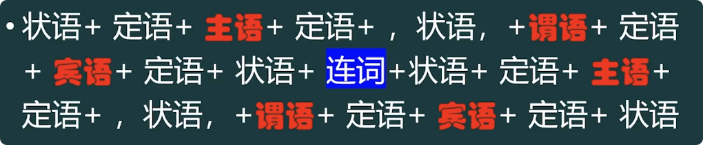

# 长难句

### 长难句公式

> For example, in the early industrialized countries of Europe the process of industrialization - with all the far-reaching changes in social patterns that followed - was spread over nearly a century, whereas nowadays a developing nation may undergo the same process in a decade or so.

例如，在欧洲早起工业化的国家中，工业化的进程持续了大概一个多世纪，同时随之而来的是在社会模式方面的深渊改变，然而现在一个发展中国家可能经历相同的过程只用十年左右。

### 定语

> 作用：缩小名词范围  — 修饰限定名词
>
> 公式：定语的使用公式 = 名词的使用公式
>
> ​	the adj.  A (of B of C in D about E) (for F to do G) (done by H)    【  <u>A - H 是名词、代词(全称代名词)</u>  】
> ​	
> ​	形容词 + 名词A  + 【介词短语、不定式短语、分词短语】

play a role in  起…作用

play the role of 扮演…的角色

People = individual

everyone = every individual

think = assume

> The role of natural selection in evolution was formulated only a little more than a hundred yearsago, and the selective role of the environment inshaping and maintaining the behavior of the individual is only beginning to be recognized and studied.

在进化中自然选择的作用形成了才100多年，并且在塑造和保持个体行为方面，环境的选择作用才刚刚开始被认识和研究。

That 

